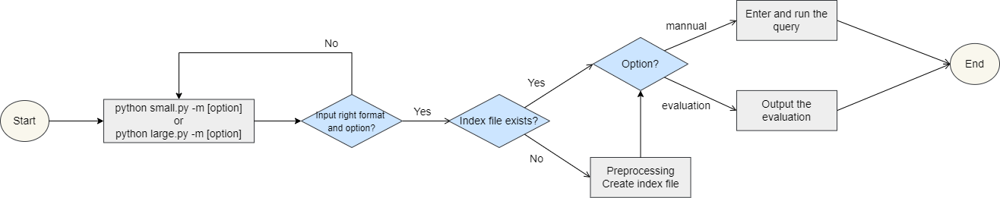

# COMP3009J Information Retrieval

## Programming Assignment

### Yang Liuxin 19206207

This file describes the contents and features of small.py or large.py. **The program could execute on both small and large corpora.**

### Flowchart



## Preprocessing
### Preprocessing approach
Firstly, I convert all words to **lowercase**.
Then I **remove punctuations but not hyphens** that appear in the words internally and separate words based on that. Moreover, I 
separate words via spaces. **icons**, such as "copyright", which are also removed completely. The reason for my design
is that I think users are very less likely to enter queries including these things. Therefore, there is no 
need to store those things in the index, which contributes to the better efficiency of our program.
I include **digits** in the index file. The reason for my design is
that I think they could be searched sometimes by users. For example, users may want to look up error codes/stacktraces on the web.
Moreover, I do **not store the word with only character** after preprocessing. Additionally, I **remove all terms with negative individual
bm25** because they occur too common in the collection.
### Create the index file
When there has not been an index file, the program will do the preprocessing and create an index file for following queries or
evaluation to load for. The stored **dictionary** serves as the **index file** and will be loaded when users enter new queries or perform the 
evaluation. <br>
<br>
To be specific, the **key** of the dictionary stored in the index file is the stemmed **term** after preprocessing. 
The **value** of the dictionary stored in the index file is also a **dictionary**, whose **key** is the **docID** that 
the term appears in and **value** is the **individual bm25** that the term contributes to the bm25 of the doc that it appears in.
<br><br>
The following gives some examples of my stored index file. In this example, the key is the term "success", and the value is the dictionary. It means that
the term "success" contributes 5.761069096120642 bm25 value to file "105" that it appears in. Moreover, to calcualte
the bm25 value of the file "105", I need to iterate through the index dictionary, and add the individual bm25 to
the total bm25 score of the file "105". The similar methods apply to all the other documents and terms.
```
{..., "success": {"105": 5.761069096120642, "1087": 5.839320864706645, "1088": 5.0014658802412395, 
"113": 5.974573818645186, "1158": 6.388926692461399, "1224": 6.33204700994145, "1251": 5.0802704896988224,
 "1279": 5.288592133617583, "131": 3.9097958821287615, "1338": 6.475104603799951, "14": 3.4964160536369264, 
 "149": 4.35909644541981, "173": 3.851417484525804, "284": 6.234505325418342, "318": 5.514729197483785, 
 "342": 4.62483146659649, "344": 3.440453498981525, "369": 4.55943201149496, "406": 4.658239832596464, 
 "47": 4.726525781767192, "473": 5.919727669759215, "476": 4.575607858271787, "535": 5.947024292890599, 
 "641": 5.735449162399382, "673": 3.3510601116877043, "703": 6.388926692461399, "734": 5.0209369386901415,
  "777": 5.4679677854078905, "797": 3.7836241002881117, "801": 4.743911237070406, "865": 7.3622065017974325, 
"869": 3.8979790499240607, "977": 4.832792911509647, "99": 4.216580214641045}, ...}
```
### How to use

A user could only select **'manual'** or **'evaluation'** option. 
**The standard format** should be **python small.py -m manual** or 
**python small.py -m evaluation** if the user wants to access small corpus. 
Otherwise, **the standard format** should be **python large.py -m manual** or 
**python large.py -m evaluation** if the user wants to access large corpus.
If the user does not input the 
correct format or option, he will be asked to type again.

#### Manual option

Users can type **python small.py -m manual** or **python large.py -m manual** to enter query 
manually and get the corresponding 15 most relevant documents. If there has **not** been an index file 
called "small.json" or "large.json" yet, the program will do the preprocessing and **create an index** 
file that stores a **dictionary**. 


If there has not been an index file, the following things will be shown in the command line.

```
python small.py -m manual

Creating index file...
Preprocessing time is 0.6875 seconds
Enter query: 
```


If there has been an index file, the following things will be shown in the command line.

```
python small.py -m manual

Loading BM25 index from file, please wait.
Loading index takes 0.046875 seconds
Enter query: 
```

 Part of the index file is shown below.

##### Small corpus:

```
"..., relat": {"10": 4.8763316593207655, "1007": 3.8994200025610173, "1011": 3.9162124219154983, "1016": 3.7006770484611766, "1027": 5.142235309163916, "103": 3.348816719374164, "1042": 3.7006770484611766, "1056": 2.5964497522318295, "1058": 4.574727771436008, "1087": 3.348816719374164, "110": 4.242607136110823, "1123": 3.57545272036307, "1128": 3.3187645202771785, "1131": 3.45842574541353, "115": 2.890732097781816, "1185": 4.082360007096665, "1195": 2.4261162893694745, "120": 3.4910729362135324, "1209": 2.434100436877272, "1240": 2.857231468268505, "1244": 1.887483802532597, "1247": 3.0835546946321863, "1250": 2.410304104124833, "1265": 3.0329769795753436, "1268": 3.118483793261547, "1294": 2.890732097781816, "13": 3.2746841178531896, "1301": 4.1394783192622215, "1309": 2.5783476159160137, "1327": 3.3187645202771785, "1330": 3.7895377911967096, "1336": 2.7509620112290123, "1337": 3.0707527792102427, "1361": 4.105017127793173, "1366": 3.799270526431959, "137": 4.991510231379226, "1382": 2.386968543736361, "140": 3.768214991153407, "149": 2.4999165820835074, "16": 3.2459420103237586, "198": 3.3669063459840394, "20": 2.972041197772999, "205": 2.3123446834694885, "207": 2.948347008048527, "24": 2.4999165820835074, "240": 2.4999165820835074, "247": 2.960146689244025, "255": 2.84623647801093, "262": 2.049626785754038, "263": 3.2892468992844965, "311": 2.879478274406075, "314": 2.9250276275472205, "317": 2.6428370155518355, "322": 4.066946404430574, "329": 1.4065200039663546, "33": 2.410304104124833, "339": 4.089432285767271, "341": 2.7509620112290123, "342": 2.6523140787202024, "349": 2.5873670222216902, "364": 2.055322302943054, "369": 2.614807869735236, "373": 2.235468424599356, "377": 3.203762573285188, "378": 3.795631129417245, "379": 4.116440260940415, "38": 5.010521071514996, "396": 3.8955863031202975, "409": 3.5928205282663876, "415": 3.410584012077039, "418": 3.9162124219154983, "43": 3.17624671952093, "440": 3.5412160202000016, "444": 3.645951295197702, "455": 3.8486938603693086, "476": 2.624084624239973, "479": 3.260249718274054, "483": 4.1351583269797265, "490": 3.7380828137758106, "540": 3.8090533839003693, "541": 4.301466744276127, "55": 3.17624671952093, "559": 4.518829338256193, "561": 2.7407682290727777, "562": 2.7612319042525155, "565": 4.556222579120186, "57": 2.984031681357344, "574": 2.8030898916843374, "580": 4.911736227769881, "596": 3.57545272036307, "599": 2.50839470750319, "611": 4.911736227769881, "614": 2.8244984193703173, "615": 3.645951295197702, "618": 3.2317593333197223, "62": 2.2979763445084105, "626": 3.020590740889357, "637": 4.371923312955277, "645": 3.0964637988519694, "650": 3.8751763155035297, "667": 4.148662483654063, "675": 3.344072638058476, "680": 3.2459420103237586, "681": 3.45842574541353, "682": 2.835325783615284, "689": 3.485917551540078, "695": 2.0668088284811117, "701": 2.402475052249157, "704": 2.2220368097910286, "705": 3.7227802802787084, "706": 4.546606749974021, "72": 2.410304104124833, "720": 3.8994200025610173, "73": 2.276755549207184, "732": 4.493086931863687, "744": 3.394929556697248, "757": 3.277392706867129, "77": 2.176271045760417, "778": 4.844393411617591, "779": 2.78200345819624, "794": 2.418184348580341, "797": 2.169886522841112, "798": 1.544567700304414, "8": 3.149199486598526, "801": 3.760636496266899, "814": 2.7106351798892274, "820": 4.187811642701102, "822": 2.7509620112290123, "830": 2.902074232614859, "837": 2.4999165820835074, "843": 3.0454652185799085, "844": 3.799270526431959, "851": 4.24642316044192, "873": 2.972041197772999, "874": 2.402475052249157, "881": 3.149199486598526, "882": 4.02270840873336, "889": 2.418184348580341, "907": 2.7206056378829344, "914": 2.890732097781816, "921": 2.890732097781816, "927": 1.8405158910561723, "928": 1.9836634706394793, "931": 3.9162124219154983, "940": 3.57545272036307, "96": 2.5516627854845, "960": 3.2892468992844965, "961": 3.020590740889357, "97": 2.6055964751729936, "99": 2.418184348580341, "998": 3.122609004020998},...}
```

##### Large corpus:

```
{..., "link": {"GX000-01-10544170": 1.4252489514842341, "GX000-09-2703409": 1.046028375915798, "GX000-10-4524900": 1.0385411865959973, "GX000-14-16748010": 0.9991018462011021, "GX000-14-5445022": 1.1429406286592148, "GX000-16-0145015": 1.29707147879568, "GX000-16-4063715": 1.2235364652283582, "GX000-21-2440731": 0.9844247417067238, "GX000-22-12322384": 1.0174904985527347, "GX000-26-8535353": 1.2591738620950175, "GX000-29-8328421": 0.5652295762847731, "GX000-37-9159393": 1.0916556710863832, "GX000-38-10952535": 0.5003542848585097, "GX000-43-1993135": 1.2662383237195916, "GX000-46-8625035": 1.0499469904106644, "GX000-47-11266472": 0.9369063500288701, "GX000-49-12224349": 0.7208975232282147, "GX000-53-0788254": 0.45119630342517175, "GX000-55-3026780": 1.2123008385581588, "GX000-56-16493385": 1.0687572582576506, "GX000-60-10029828": 1.2846844004545281, "GX000-62-7241305": 1.125505088274777, "GX000-63-3474016": 0.9974867958998757, "GX000-63-3636455": 0.5635280014187403, "GX000-66-4641344": 1.064770199034525, "GX000-69-6846304": 1.0271910988475288, "GX000-76-2231612": 1.4086166901059813, "GX000-77-6847828": 0.7620639932115054, "GX000-80-10421013": 1.2296506877780828, "GX000-81-0219756": 1.2574248429855617, "GX000-82-0419685": 1.1171691333914184, "GX000-88-5542873": 1.136054079872715, "GX001-06-14795789": 0.7965102896649395, "GX001-07-10752136": 0.8725651260602807, "GX001-08-5834860": 1.0478399051455682, "GX001-10-4196524": 1.2750872008492355, "GX001-10-9697910": 1.2141440535726844, "GX001-16-14126351": 1.1376577823964042, "GX001-22-5770689": 0.35687591189008744, "GX001-27-3364162": 0.7686395157249912, "GX001-27-5701295": 1.243049415674858, "GX001-28-5148808": 1.3149022230437317, "GX001-30-5435939": 1.2980456016557178, "GX001-30-5929274": 1.106425049512053, "GX001-35-14901241": 0.7351552968831333, "GX001-35-8607922": 1.343275300036464, "GX001-37-11210821": 1.1817366485976801, "GX001-37-16595181": 1.1657850463657558, "GX001-39-3118899": 0.8272117092522792, "GX001-43-11803200": 1.0980204484951324, "GX001-46-16382383": 0.9307398014524084, "GX001-48-9171058": 0.8832630633043616, "GX001-55-9534445": 1.0974803611831068, "GX001-56-9722305": 1.4580066177872537, "GX001-57-6099691": 1.065467564160797, "GX001-57-7990636": 1.005167934041657, "GX001-60-13661262": 1.1046244666635028, "GX001-66-16428067": 1.041214649085179, "GX001-70-12360249": 1.2087387619936143, "GX001-74-13736702": 1.121970336756967, "GX001-79-3175557": 0.9401221308829801, "GX001-84-3895877": 1.0124383810090622, "GX001-85-13412715": 1.2144699087952082, "GX001-86-15669511": 1.1155167379831112, "GX001-87-8879604": 1.2607725112835624, "GX001-90-15258159": 1.345709873442553, "GX001-97-16320609": 0.7311340657571519, "GX001-98-0763964": 1.155447162563793, "GX001-98-11789769": 1.108307949806455, "GX001-99-8007459": 1.0160578613815168, "GX002-00-9339550": 1.0862400331146336, "GX002-01-6679231": 0.8873042332842944, "GX002-04-12932501": 1.1689218479927772, "GX002-07-14584103": 1.181095341530091, "GX002-11-16206723": 0.7579228097439453, "GX002-13-4333063": 1.0287819643782745, "GX002-16-7577442": 1.021658954111581, "GX002-21-7842553": 1.0743766675180109, "GX002-25-13891501": 1.3835498663061827, "GX002-25-4335841": 0.8979518285760407, "GX002-28-9881151": 1.0439720384913733, "GX002-29-13068057": 1.3998428476023292, "GX002-41-3591517": 0.6067059157485009, "GX002-41-8193706": 1.17261358974808, "GX002-44-10720049": 1.1534284319812156, "GX002-47-11988983": 1.0502719097562079, "GX002-48-16432533": 1.3574034586767698, "GX002-50-8035813": 0.9049300927669016, "GX002-51-15101945": 1.1230841730977892, "GX002-51-9932648": 1.2729094782160253, "GX002-55-1145531": 0.6042098427636341, "GX002-57-5524313": 1.00811021130669, "GX002-58-12452923": 1.2654121108878396, "GX002-59-5385286": 0.5583822766215027, "GX002-65-16421538": 1.1124858613011321, "GX002-68-11022920": 1.069130701007702, "GX002-71-10234846": 1.0839849173171596, "GX002-73-12473723": 1.2346465482968914, "GX002-86-4588629": 1.229316636432029, "GX003-00-4115719": 1.2623356472995664, "GX003-11-0157820": 1.0800179511144874, "GX003-17-1828169": 0.8121184734351313, "GX003-20-15561399": 0.8225893495125333, "GX003-28-14943862": 0.6288521269095305, "GX003-29-10711720": 1.1984210401681652, "GX003-29-5751922": 1.1035469272473546, "GX003-30-2106188": 0.9856099117261752, "GX003-32-1012798": 1.31008949078674, "GX003-35-13500421": 1.0777511967152476, "GX003-48-7355996": 0.8913825521453704, "GX003-53-14433328": 1.1645099262284557, "GX003-55-15667784": 1.1724110495283173, "GX003-59-11845115": 1.118457718148647, "GX003-60-14577710": 1.1270000767555446, "GX003-63-8068802": 1.0391771758333608, "GX003-65-9397582": 1.1893440699463877, "GX003-67-1658978": 0.9824713974405425, "GX003-70-15021288": 1.3964536011930575, "GX003-77-10553381": 1.0041688845961085, "GX003-82-15293714": 0.9266736688424847, "GX003-83-11164453": 0.6671748481450266, "GX003-83-5645258": 0.8627927088524197, "GX003-87-7165838": 0.6383140490703912, "GX003-88-14991606": 1.0280029165089695, "GX003-90-5300889": 0.8046304150941979, "GX003-91-8426433": 1.3575038307556804, "GX003-92-12811903": 0.40053700764829764, "GX003-92-9546228": 1.0619382819280037, "GX003-94-10020086": 1.175339932426386, "GX003-94-14281439": 0.2609272776256267, "GX004-03-14914642": 1.2879828812398104, "GX004-05-11052588": 0.33891434697408157, "GX004-05-12123594": 0.9148089545105966, "GX004-07-1379111": 0.9562901069699187, "GX004-09-0089716": 0.7031848675966798, "GX004-15-1952872": 1.0484873377493646, "GX004-18-11051792": 1.0167284514881878, "GX004-19-3547597": 1.4132939195660301, "GX004-20-13012991": 0.6724654468979149, "GX004-21-2895633": 1.3546591283392069, "GX004-23-5347689": 0.9190202026638427, "GX004-32-6875096": 0.7940875342775005, "GX004-32-9488038": 0.8544651744523689, "GX004-35-0289656": 0.9650116113500526, "GX004-43-14234658": 1.1040854340475774, "GX004-43-15584788": 1.1874638886301134, "GX004-44-4958806": 1.086413892270216, "GX004-50-16028120": 1.4790991165637275, "GX004-52-11211460": 0.9599619213192846, "GX004-56-13614868": 0.9024036374972902, "GX004-56-8891084": 1.343557050526067, "GX004-60-2290824": 1.0953551142659053, "GX004-61-15951057": 1.200620241245511, "GX004-63-5127682": 0.9887685423013562, "GX004-64-16738159": 1.1692659365157074, "GX004-67-12384230": 0.8396670738033861, "GX004-75-0648415": 0.8693486274037016, "GX004-76-11859934": 0.45929548824333916, "GX004-76-4620431": 1.4105193522899768, "GX004-81-3891531": 0.780834835622116, "GX004-82-7551182": 1.304415639897259, "GX004-84-13917959": 0.6835689747979661, "GX004-87-7491531": 1.2376099046312605, "GX004-92-14158643": 1.1021134739244547, "GX004-98-5828518": 1.2515296472265542, "GX005-01-16278212": 1.2013580128501704, "GX005-02-4464054": 1.205655841439618, "GX005-05-16556238": 0.8723653306142808, "GX005-06-15271150": 1.2463590194848706, "GX005-08-16599646": 1.1204886538317833, "GX005-08-8873803": 1.4639892550356925, "GX005-09-15461561": 1.0980129621251238, "GX005-11-8373916": 1.2035462338444989, "GX005-16-6556550": 0.9389800646416637, "GX005-18-11635533": 1.0911366109287741, "GX005-22-7492751": 1.3494746871144705, "GX005-23-5015301": 0.7751598784907989, "GX005-24-16635121": 0.39558173330402663, "GX005-27-12863340": 1.1676714148902043, "GX005-27-9142235": 1.4205168337006078, "GX005-29-0821498": 0.9306121947527851, "GX005-40-8515750": 1.1592953413702403, "GX005-45-4823660": 1.0964665844844241, "GX005-47-8483952": 1.0958341363193085, "GX005-48-15082217": 1.2025286087729823, "GX005-48-5043050": 1.1305666419311113, "GX005-53-4686777": 1.2653273801432685, "GX005-65-1397330": 1.138468739968673, "GX005-92-2576178": 1.2304064926742384, "GX005-95-16734188": 1.2585237800151152, "GX005-97-3434060": 0.9532213883066847, "GX006-01-11076601": 0.947760325973088, "GX006-02-13285876": 0.7640257128225495, "GX006-11-1958736": 0.9068645265955388, "GX006-14-3166764": 1.0033524912922591, "GX006-15-1213956": 1.273484105877443, "GX006-29-9238736": 1.1788300383797627, "GX006-35-1089672": 1.1823960135232727, "GX006-36-14835033": 1.215696866612604, "GX006-38-0081351": 1.2394708904610483, "GX006-49-1900851": 1.0390885635422762, "GX006-50-2080860": 1.2143612709552398, "GX006-52-4527411": 1.1550954367904558, "GX006-59-1071812": 1.124891203625226, "GX006-64-2177402": 1.1780511714830872, "GX006-68-12276890": 1.3202731965722343, "GX006-79-1841100": 1.388033630617016, "GX006-82-12315871": 0.5727634413730391, "GX006-87-12676839": 0.9571193207730947, "GX006-91-15021001": 1.1528407293031242, "GX006-96-14383474": 0.8150439601398315, "GX007-14-12653038": 1.0842312082221972, "GX007-23-8404208": 1.3528240233625386, "GX007-27-12145574": 0.9582002289230673, "GX007-27-3518535": 1.2974020413641247, "GX007-30-11307427": 0.7828229929151566, "GX007-30-6279957": 1.310107898251933, "GX007-31-12250665": 1.0951397930015783, "GX007-36-4586266": 1.3365744949227263, "GX007-37-0966266": 0.995479925964305, "GX007-39-2116215": 1.375855956771934, "GX007-39-4638380": 1.2051819793768745, "GX007-40-12106344": 0.5896301811446338, "GX007-43-13233964": 0.68723707545519, "GX007-45-6857078": 1.1210438260947289, "GX007-49-9491769": 1.2277069500229245, "GX007-50-3764824": 1.360078004115842, "GX007-52-6873774": 0.6931320002337134, "GX007-59-9250610": 1.1659665023747317, "GX007-60-13341075": 1.175339932426386, "GX007-60-3019992": 1.0820840431513252, "GX007-62-1213196": 1.0241253084875233, "GX007-74-1857640": 1.068420802581728, "GX007-76-11296365": 0.7602817026356461, "GX007-79-13292316": 0.978646796656688, "GX007-79-4457378": 1.097175521990335, "GX007-96-12652536": 0.7733686262964158, "GX007-99-10718889": 0.9020438664579817, "GX007-99-14347438": 0.9019240065181059, "GX008-02-7223415": 1.2031680776669456, "GX008-07-14499121": 1.1042650531242333, "GX008-08-11752389": 1.3990194235330076, "GX008-12-0372379": 0.9179016918447819, "GX008-15-0860531": 0.9826136234902518, "GX008-20-9189520": 1.005167934041657, "GX008-24-6611077": 1.3243303098574943, "GX008-28-11805650": 1.4696854108730415, "GX008-29-13877144": 0.40774849517089523, "GX008-30-8335257": 0.7117379783729132, "GX008-32-2501602": 0.8627189709761616, "GX008-32-2671718": 1.0158487013872863, "GX008-33-8895013": 1.3879201031632746, "GX008-46-15190940": 0.990644539970237, "GX008-57-2482846": 0.9464428694408704, "GX008-59-16244161": 1.2702667531247613, "GX008-60-4660380": 0.45405703081982934, "GX008-61-3351353": 0.871581213831339, "GX008-62-1331463": 1.227649098496619, "GX008-71-13615464": 0.8358413891295822, "GX008-72-4601905": 0.7726643487187276, "GX008-73-8799753": 0.9349705440748988, "GX008-75-7759441": 0.4871746073910408, "GX008-82-5743099": 1.402140302460265, "GX008-83-7595521": 1.0508054751161173, "GX008-86-6768395": 0.969006767866622, "GX008-88-16390139": 0.9130861078362006, "GX008-89-13408841": 1.2974614273408431, "GX008-92-16663159": 0.48038234647914846, "GX008-94-16491289": 0.9003451560038117, "GX008-95-1952368": 1.458424277466198, "GX009-01-4088053": 1.314220029639765, "GX009-04-4844866": 1.095531903746875, "GX009-12-14837772": 1.0920563982620477, "GX009-16-14839403": 0.6779026143769763, "GX009-19-10005177": 1.3615735668627278, "GX009-24-15435843": 0.8035617966340068, "GX009-25-8099699": 0.820186689509218, "GX009-27-9159972": 0.8892804595877307, "GX009-34-11020662": 1.3408774284638554, "GX009-36-9934198": 1.2802093648268942, "GX009-51-9507908": 1.2327772772740402, "GX009-52-3863001": 1.0548419880569027, "GX009-53-15486940": 1.1907154003618539, "GX009-58-4267458": 1.2411331133904588, "GX009-60-11892722": 0.6230223759365251, "GX009-61-15418142": 0.8712770887695139, "GX009-63-3705664": 1.3106138257171813, "GX009-65-1341648": 0.5311809596610475, "GX009-67-11341046": 1.149576519436397, "GX009-68-14214729": 1.2605944338392272, "GX009-78-5072824": 1.2007204660531008, "GX009-80-16760029": 1.108955749734841, "GX009-81-9747689": 1.1203037185847826, "GX009-83-12395859": 0.4071370613407697, "GX009-88-11439685": 1.0120620734078942, "GX009-91-0618518": 1.1003268856159758, "GX009-93-8826706": 1.1697361059903548, "GX010-02-6397036": 1.1882336569398637, "GX010-06-10730361": 0.6258371107717212, "GX010-06-3453889": 1.0218127531837211, "GX010-07-8794130": 0.7285444016610509, "GX010-16-8667301": 0.9591861975954564, "GX010-19-0932978": 0.9575243754278876, "GX010-23-15678456": 1.2790032210143065, "GX010-23-6970209": 1.2956040315350035, "GX010-24-3021201": 1.1766791408510693, "GX010-27-2862319": 1.271183685488252, "GX010-32-3488567": 0.888672893417304, "GX010-35-15955392": 0.7432224777649997, "GX010-40-4240393": 1.1951002599773803, "GX010-42-7125010": 0.7163197490802434, "GX010-49-1462037": 0.9425003519356142, "GX010-53-13889535": 1.183655660182507, "GX010-55-9999707": 1.0980129621251238, "GX010-61-4890518": 1.0735270645493094, "GX010-62-0367708": 1.233735082227926, "GX010-64-5112952": 0.8291030514239981, "GX010-67-10716880": 0.9298194712885441, "GX010-67-14370619": 1.0308130257342096, "GX010-68-3391193": 1.0478399051455682, "GX010-75-1336863": 0.8923200088045116, "GX010-78-13775342": 1.459299357828192, "GX010-87-0022787": 1.097289179958386, "GX010-93-2922210": 1.3271881649674764, "GX011-07-9890982": 0.9054129271219088, "GX011-14-8608111": 0.8587894915294002, "GX011-24-5888638": 0.9257889336575598, "GX011-28-10825698": 1.1069663695857475, "GX011-30-6594776": 1.0188984664501965, "GX011-32-10790330": 0.5795117207080268, "GX011-36-10045558": 1.1320751160019547, "GX011-36-2526928": 0.8889275064142067, "GX011-47-10750661": 1.085854544449751, "GX011-49-5606104": 0.7552128498372852, "GX011-50-9986792": 0.7481195204308908, "GX011-61-11341012": 1.2277913973878865, "GX011-65-4632316": 0.9883366283450998, "GX011-65-8019171": 1.1808756922795138, "GX011-67-14143188": 1.2122129098936756, "GX011-69-14497315": 0.9927704495521238, "GX011-72-0516250": 1.2737567323838717, "GX011-73-15271354": 1.0326949825852514, "GX011-75-7860217": 1.350683077235207, "GX011-76-8632332": 1.0367962234168506, "GX011-79-10070269": 1.1536796834294605, "GX011-81-10306672": 1.3314032616471319, "GX011-81-5638374": 1.2895734262869987, "GX011-81-5661147": 0.9385905442015579, "GX011-96-0392166": 1.3713902025136682, "GX012-00-16749717": 0.7996066978352195, "GX012-01-9298450": 0.7351726859256307, "GX012-03-15711379": 1.1425639591186316, "GX012-04-2733983": 1.1433798994001991, "GX012-05-10214802": 0.8491206358571808, "GX012-16-4966919": 1.0571419741614487, "GX012-18-2680242": 1.1136864666215902, "GX012-19-13081887": 1.1494926060122639, "GX012-19-6427895": 1.1537777348418423, "GX012-20-10609391": 1.0488722075548664, "GX012-25-15935953": 1.0445795908432165, "GX012-34-6585617": 0.7819015370837842, "GX012-36-6668374": 1.0185926661551, "GX012-45-1565890": 1.2281801749289394, "GX012-46-12147526": 1.1082391383525412, "GX012-52-3036515": 1.2950427849953328, "GX012-61-15153581": 1.1375772427239688, "GX012-62-8042090": 0.9119536179293207, "GX012-65-12108602": 0.7567283581966985, "GX012-72-14266289": 1.2989745172908933, "GX012-73-4547025": 0.9321457883190564, "GX012-77-16466637": 1.0853715713514382, "GX012-78-2374834": 1.2170592316212747, "GX012-80-1355027": 1.2578306968828012, "GX012-83-9941255": 1.282507316586717, "GX012-89-1164035": 1.2555810029533065, "GX012-95-3579128": 0.9652003588312182, "GX012-96-0884988": 1.2059157933493525, "GX013-02-1888344": 1.0589846398377916, "GX013-13-15521312": 1.24784836266822, "GX013-22-12048080": 0.7797653772891807, "GX013-28-14475109": 1.0523887972137753, "GX013-30-0282301": 1.1187112711381852, "GX013-37-9406121": 1.3854271891671435, "GX013-41-2055294": 0.9150556063393688, "GX013-48-12705480": 1.000173832351378, "GX013-51-9369770": 1.4173705386141076, "GX013-52-11051279": 1.0453034813776445, "GX013-62-1683683": 0.4653889724227079, "GX013-68-6133860": 1.2650583496424888, "GX013-74-7552273": 1.0904280702123017, "GX013-76-3577337": 0.9926728225880371, "GX013-78-8105795": 0.9420139781706077, "GX013-81-6569225": 0.9614576516570178, "GX013-84-7050535": 1.2003104491728425, "GX013-90-8184563": 0.918398471457851, "GX014-01-4428177": 1.131697620228412, "GX014-07-7451115": 1.307903830313304, "GX014-10-14564806": 1.0609423749525546, "GX014-28-1863750": 1.0480016883253518, "GX014-31-7269472": 1.1122265681792294, "GX014-33-6016833": 1.2758778574708236, "GX014-38-15645365": 1.0832929181277224, "GX014-42-16535232": 1.1035469272473546, "GX014-70-14011315": 0.6911558206790607, "GX014-75-11217120": 0.8983429611615614, "GX014-76-0718171": 1.396549373070431, "GX014-78-5394706": 0.7880031488444749, "GX014-79-7754964": 1.1846030494217374, "GX014-82-15415259": 1.120355792208882, "GX014-82-1816259": 1.3403478710462056, "GX014-94-1782160": 1.2228937986921544, "GX014-98-1920556": 1.0951783818338956, "GX015-13-9609369": 1.3722551496810764, "GX015-24-9993283": 1.2333128008031076, "GX015-26-5522499": 1.1460281886507766, "GX015-32-10433276": 1.2503769147096462, "GX015-34-6126755": 0.8032972706015011, "GX015-38-12832629": 0.9253827257627227, "GX015-38-14454442": 1.269736612485858, "GX015-41-16610564": 1.1537912606946805, "GX015-41-6877327": 1.0838118346498289, "GX015-43-0960090": 1.1412832245074949, "GX015-45-16339159": 1.105524024929481, "GX015-46-13202292": 1.1870561127441628, "GX015-55-8441657": 1.4196819371401856, "GX015-59-0959338": 0.9155223406585927, "GX015-62-11085040": 1.4143743141296115, "GX015-85-15388948": 1.1140520402566774, "GX015-87-9252101": 1.2324415252390322, "GX015-88-9728556": 1.349877243508035, "GX015-94-13914556": 0.8821151956351668, "GX015-94-3379176": 0.9868996364096637, "GX015-97-5469307": 1.1273744446339748, "GX016-00-8194160": 0.44647742688771797, "GX016-03-6335156": 0.9366477795516259, "GX016-04-1437459": 0.7228034431446095, "GX016-11-5766970": 1.159536632293567, "GX016-12-6578685": 1.0540229879720846, "GX016-24-4285158": 0.7637100199012493, "GX016-30-0658637": 1.2799503838489659, "GX016-31-12013067": 1.1141207000545799, "GX016-39-6070174": 0.9766753696525229, "GX016-43-0594936": 0.8578127083821188, "GX016-45-14872350": 0.45551966332905836, "GX016-51-2435743": 1.3975791445920074, "GX016-52-15666196": 0.5487763871559522, "GX016-52-2900403": 1.1697097366342413, "GX016-55-7683219": 0.9504559866229263, "GX016-59-3348587": 1.320196946437396, "GX016-66-7308971": 0.3907764005820988, "GX016-67-0177261": 1.044132629411164, "GX016-79-10366782": 0.637115766609945, "GX016-90-16266790": 0.8808559822029356, "GX016-91-5340287": 0.8649175927554849, "GX016-99-1396104": 1.1201188443743688, "GX017-03-1777733": 1.0851475278952536, "GX017-08-6496610": 0.2805441540607927, "GX017-49-7408691": 1.295727692458854, "GX017-51-1948219": 0.9246538963159227, "GX017-53-9952629": 0.8061385281796726, "GX017-56-0016825": 1.1133211328321067, "GX017-60-6170360": 1.3518742908020354, "GX017-64-14169895": 1.2435433607298667, "GX017-66-14467043": 1.1987060245641248, "GX017-71-5680187": 1.1549985725612792, "GX017-72-10409089": 0.8664679694834512, "GX017-79-16266698": 1.3575844513517177, "GX017-83-5413779": 1.119010879189735, "GX017-91-15768261": 1.3155061187261388, "GX017-93-0483642": 1.3163325523318228, "GX017-96-15230728": 0.5785731854812355, "GX017-98-8542145": 1.23300121361404, "GX018-00-7821485": 1.2367079444414422, "GX018-01-7599950": 1.1146008509367393, "GX018-04-14405035": 1.1247590803979746, "GX018-10-11691519": 1.040451494003358, "GX018-16-1291572": 1.227189033917323, "GX018-18-5887287": 0.8443969754799289, "GX018-21-8078798": 1.2947807962460436, "GX018-22-7370077": 0.9892008339249384, "GX018-24-8289999": 1.314453792539695, "GX018-25-11093219": 1.3886350392826463, "GX018-25-11947740": 1.1765623121176574, "GX018-49-2810081": 1.285525811995028, "GX018-51-1208563": 0.8704634890715618, "GX018-62-13993883": 0.9789688389418453, "GX018-66-0380118": 1.0153928105962722, "GX018-66-10658961": 0.7987598378670372, "GX018-69-15630225": 1.0356888420924237, "GX018-69-5968148": 1.1631131088288018, "GX018-73-2663421": 1.424739218009128, "GX018-78-13390485": 1.3638783416894331, "GX018-87-4458472": 1.1885716660303827, "GX019-03-0277677": 1.4183142271023785, "GX019-16-10452782": 1.393790744233041, "GX019-22-13946357": 1.145907360901419, "GX019-22-3409182": 1.179029623573065, "GX019-23-7956464": 1.2544207987417182, "GX019-30-8388671": 1.1424447812096814, "GX019-33-11484591": 1.1123690335353238, "GX019-41-2133661": 1.0768144303983311, "GX019-45-5337133": 0.9122271156691611, "GX019-49-13135231": 1.1193799572946428, "GX019-49-15724232": 1.259750037186592, "GX019-49-16096677": 1.3144207730545083, "GX019-51-6125705": 1.3958896941861254, "GX019-54-2124428": 1.173164526698986, "GX019-59-6127275": 1.161051167056338, "GX019-66-5691177": 1.3113734499967196, "GX019-71-12878451": 1.1198936781125188, "GX019-74-8241189": 1.1551378960766214, "GX019-76-1199410": 1.2530313808242455, "GX019-76-16137851": 1.2033813851252873, "GX019-77-9226435": 1.0452581507197591, "GX019-78-6427053": 0.9496207112483661, "GX019-84-13366992": 1.0627696337812917, "GX019-88-0259719": 1.347274645091954, "GX019-97-1357652": 0.7407082526284184, "GX019-99-7053346": 1.227041138137735, "GX020-01-3838514": 1.2962225723045655, "GX020-03-10038187": 0.9129632956382485, "GX020-05-12009441": 1.1618750658549966, "GX020-07-4495472": 0.9406717292648048, "GX020-16-3222999": 1.4070818235881366, "GX020-33-14039487": 0.9325019986072145, "GX020-36-14224421": 1.1421153751643458, "GX020-37-7026375": 1.2351081323341757, "GX020-43-9416325": 1.1313203761264314, "GX020-47-15367411": 1.1003268856159758, "GX020-52-13412435": 0.7046448453634478, "GX020-52-7971412": 1.1439037025120908, "GX020-58-9566030": 1.1188264313906089, "GX020-60-2262246": 0.5465981293937862, "GX020-62-0115418": 1.4337644906673894, "GX020-62-2803927": 0.9493924701248845, "GX020-63-0257256": 1.0471932716173307, "GX020-68-0724671": 0.5173240872622415, "GX020-69-12254259": 1.0994357618231585, "GX020-73-9946416": 0.8347107369903703, "GX020-81-16617260": 0.9817608843304074, "GX020-84-10061314": 1.1768342974207968, "GX020-92-4659874": 1.1221558226960922, "GX021-08-13644385": 1.226761593386197, "GX021-11-3873241": 0.40994018614204564, "GX021-13-8007606": 0.8466845347471146, "GX021-17-13371025": 0.33040181930627, "GX021-17-16045566": 0.8301170195018813, "GX021-20-3674155": 0.8610534711104002, "GX021-28-12863044": 1.1557935418887222, "GX021-28-4394229": 1.0666106783926597, "GX021-36-10765455": 1.0820840431513252, "GX021-40-9010854": 0.786906900366004, "GX021-53-14563322": 1.176985193938074, "GX021-54-13331153": 1.1803623157870815, "GX021-64-0252461": 1.1735258874106886, "GX021-69-7441405": 0.9537571455180985, "GX021-74-16720731": 1.3738590513234172, "GX021-76-1305424": 1.0459023958774067, "GX021-78-14111704": 1.1164341314682138, "GX021-83-10417175": 1.2955301308465688, "GX021-84-9714545": 1.0460635812736565, "GX021-86-0693589": 1.0589561543994235, "GX021-88-1473444": 1.1813895155332466, "GX021-90-6890051": 1.047516488589493, "GX021-98-16545321": 1.2935054013554046, "GX022-00-10792405": 1.4108210644644992, "GX022-03-5195345": 1.370661805949744, "GX022-09-16188802": 1.142555853029907, "GX022-11-0852758": 0.9146497885181812, "GX022-16-16220367": 1.106025103713811, "GX022-31-15245902": 0.876339033687555, "GX022-31-7467566": 1.1922840480670998, "GX022-37-9360299": 0.9167859003253965, "GX022-41-15642543": 1.1238279600957026, "GX022-46-12308937": 1.2224579570921452, "GX022-52-15884549": 1.099257710243607, "GX022-57-9451983": 0.9562324254377871, "GX022-64-3197382": 0.6440680003708862, "GX022-65-4225381": 0.9976334028598192, "GX022-66-2133207": 1.3429209514814069, "GX022-73-7627914": 1.0845044971697724, "GX022-90-9320783": 1.3389473741682838, "GX022-91-4208711": 1.264586975550759, "GX023-01-8446983": 1.3794581483694848, "GX023-04-2686943": 0.9540252500286791, "GX023-04-6052680": 1.0850245753553058, "GX023-17-13211133": 1.0748870750970156, "GX023-20-4246164": 1.0394606979932324, "GX023-21-4679579": 1.0265212134699935, "GX023-28-14550002": 1.2092614413225378, "GX023-29-8603905": 1.112044349949168, "GX023-47-12204648": 0.8647282484218376, "GX023-47-2029268": 1.1565729937745766, "GX023-48-8218310": 1.4084248585467871, "GX023-49-8257560": 1.1953285164418324, "GX023-58-7498099": 0.89716058824109, "GX023-62-13680855": 0.9884805577313708, "GX023-76-16463369": 0.8213776937792945, "GX024-03-5558222": 0.9500194425928672, "GX024-13-4481767": 1.0918312683136089, "GX024-16-7078307": 1.2499164160552525, "GX024-21-8808558": 0.9000105702987852, "GX024-21-8854148": 1.0098295190524105, "GX024-31-12845288": 1.1158835143964747, "GX024-40-9177087": 0.7350930684979964, "GX024-54-11678482": 1.2111838065143488, "GX024-55-0695379": 1.2026396301939795, "GX024-62-4321660": 0.8883694215476846, "GX024-64-10288263": 0.9421406728444596, "GX024-71-15217058": 0.9782236783115069, "GX024-71-9539600": 0.7112741988887676, "GX024-79-10440452": 1.08056762924286, "GX024-93-13271334": 0.5035464996592723, "GX025-06-9419689": 1.135294027006746, "GX025-07-10429467": 1.0170664139339276, "GX025-09-9454936": 0.6723076081625725, "GX025-25-4699248": 1.0356888420924237, "GX025-41-8242820": 0.764484153535055, "GX025-50-15949743": 1.0974803611831068, "GX025-53-13533381": 1.1534284319812156, "GX025-66-10756557": 0.6396373766642744, "GX025-66-4710997": 0.699705482639581, "GX025-67-0369887": 0.9933992235379603, "GX025-68-4048778": 1.1307549813073667, "GX025-74-9313818": 0.8893969823716623, "GX025-75-16216007": 0.757657500154517, "GX025-77-5856749": 1.3930145403683918, "GX025-81-15111278": 0.9776600893223615, "GX025-85-12638690": 0.8881169088143103, "GX025-94-3114347": 1.0380184804573773, "GX026-07-9875405": 1.305948853165191, "GX026-08-3686448": 1.0865878070890844, "GX026-10-13695924": 1.0548419880569027, "GX026-16-11928943": 1.270029077279771, "GX026-19-16534220": 1.1212290057905983, "GX026-20-1303006": 1.1784602300880804, "GX026-23-10309684": 1.0596174010766424, "GX026-23-4628208": 1.0573066427370048, "GX026-24-16279009": 1.0393362948712166, "GX026-25-2273979": 0.9171304659051648, "GX026-28-8988394": 1.3084663281880982, "GX026-34-12838550": 1.145834727515695, "GX026-36-14035841": 1.0281586316787628, "GX026-36-2812711": 1.0813944680392353, "GX026-37-2512847": 1.094472022043529, "GX026-42-8748002": 1.02474375881373, "GX026-47-3511938": 1.0573066427370048, "GX026-49-10063170": 1.1084124827278872, "GX026-55-4495290": 1.2966585123880199, "GX026-61-9725690": 1.29726333672477, "GX026-64-9135963": 1.2634431885484814, "GX026-65-2796678": 1.2539573171958394, "GX026-69-12728019": 0.5765582469666839, "GX026-92-10258928": 0.3071528440460406, "GX026-94-3151922": 1.26550431127243, "GX027-04-3570243": 1.056776858244734, "GX027-11-7727721": 1.2671300908991894, "GX027-16-1696240": 0.5361621495339293, "GX027-22-15544468": 1.0323808460481037, "GX027-24-13868034": 1.3349097263677288, "GX027-28-1139936": 1.3951785461947195, "GX027-30-13150880": 1.129062182551451, "GX027-32-10747542": 1.180723796607731, "GX027-34-13626583": 0.7826424695458175, "GX027-36-0674678": 1.092534222496695, "GX027-40-8671508": 1.1466089642191521, "GX027-42-8507420": 1.1778021143949247, "GX027-55-2509079": 0.9559062103709182, "GX027-57-14746895": 0.9459152957935331, "GX027-59-12212600": 1.2738787768992292, "GX027-61-13947880": 1.05341473989223, "GX027-62-8974943": 1.2459014750182493, "GX027-69-12579393": 1.0745946561877717, "GX027-74-8681742": 1.2891882040600642, "GX027-87-10038740": 1.3565542700557778, "GX027-87-11737511": 1.0987239013583918, "GX027-88-3105119": 0.9547339870428263, "GX027-89-3427148": 1.3798568696467606, "GX027-89-7990485": 1.364119620787318, "GX027-91-5669265": 1.0280029165089695, "GX028-04-3285828": 1.0153928105962722, "GX028-05-3061822": 0.7768204472143584, "GX028-08-7683856": 0.8055853735274128, "GX028-13-0694924": 0.5136551891974659, "GX028-19-6159674": 1.1324528636989912, "GX028-30-13928187": 0.9749977886812188, "GX028-39-5713582": 1.125505088274777, "GX028-47-0012632": 1.2722905952205572, "GX028-59-2393765": 0.9409325265224349, "GX028-70-14760515": 0.9484638436658323, "GX028-72-3785388": 0.7622520369201329, "GX028-81-1151506": 1.0518995276703957, "GX028-92-1505973": 0.828495858702745, "GX028-92-6564078": 1.0656059925493224, "GX028-97-14327482": 1.1406358544416226, "GX029-01-16216784": 1.0747168853612188, "GX029-33-12693884": 1.185102284314191, "GX029-39-0098946": 0.773016327094788, "GX029-40-2016586": 0.7376494093236324, "GX029-61-12859351": 1.1381494823211054, "GX029-62-16243433": 0.9703920891568905, "GX029-69-11464944": 1.2489964355739143, "GX029-79-5419511": 0.8337879306609526, "GX029-89-7943366": 1.0143733428056474, "GX030-10-2788302": 1.1657183092713757, "GX030-16-5897914": 0.84510328987705, "GX030-22-4908601": 1.326773090911677, "GX030-27-12709045": 1.0230526135553533, "GX030-29-16659474": 0.6893505749594463, "GX030-31-5666563": 0.8714740280514722, "GX030-32-14289248": 1.318572701202623, "GX030-32-1719667": 1.1402526288108057, "GX030-33-16657314": 1.050597030264787, "GX030-35-15523356": 0.8687280437299525, "GX030-35-3028146": 0.730714739938121, "GX030-41-15821820": 1.1446753309614703, "GX030-42-3568498": 1.3929021406551283, "GX030-45-15369635": 1.221934134616331, "GX030-46-13212196": 1.1992354851287115, "GX030-57-15098378": 0.9232704023999541, "GX030-57-2221085": 1.02567283608797, "GX030-59-15904090": 1.3867858491879375, "GX030-60-0093581": 0.9516177220291149, "GX030-60-3550004": 0.9864693533063359, "GX030-62-15230260": 0.9496207112483661, "GX030-62-2172797": 1.0738667444405992, "GX030-63-16405635": 1.011609574237953, "GX030-68-5504182": 0.9140697961950969, "GX030-99-8998803": 1.0951783818338956, "GX031-01-3503918": 1.3712295669863308, "GX031-04-1604302": 0.6931320002337134, "GX031-04-8993139": 1.1669687886180087, "GX031-06-9725844": 1.0614400948353657, "GX031-07-8773759": 1.13321708987913, "GX031-09-15928290": 1.0428492837313739, "GX031-24-10563392": 1.171890276224849, "GX031-32-8523562": 0.9942405035808439, "GX031-37-5671974": 1.1271872296104597, "GX031-39-7722208": 0.9628214569487561, "GX031-44-6574976": 0.8604224161905096, "GX031-48-16696302": 1.1206736501456034, "GX031-49-2761474": 1.2703856244097371, "GX031-52-9370671": 0.9598261765676691, "GX031-57-12632199": 1.0095351115378297, "GX031-57-3854678": 1.2241067606483051, "GX031-59-6482903": 0.3120240689686084, "GX031-60-2142232": 1.1717166588145314, "GX031-85-0001090": 0.6193838960441916, "GX031-85-14725261": 1.1896719263450246, "GX031-90-12008400": 1.3973781391355926, "GX031-91-10107226": 1.2723152662671333, "GX032-08-7220157": 0.45653740724401265, "GX032-09-5193556": 1.0221204902859873, "GX032-37-7126687": 1.0026500524758586, "GX032-44-9044833": 1.1898804748123109, "GX032-54-5681682": 1.1078697477431096, "GX032-89-3670258": 0.9596904702009771, "GX032-94-11983925": 1.1191953878143823, "GX033-05-7334932": 1.1055747336149468, "GX033-37-3816773": 1.0480016883253518, "GX033-47-16222681": 1.3950663836171189, "GX033-50-9898679": 1.3355349127982121, "GX033-56-2288925": 1.2629895618552314, "GX033-69-6901132": 0.9912232030207979, "GX033-74-11768205": 0.9337206143229814, "GX033-76-6625972": 1.1629138369848866, "GX033-80-1485499": 0.659205150964331, "GX033-81-0973410": 1.135483944864057, "GX033-86-6195024": 0.7428158037474774, "GX033-91-11385017": 1.1444823262704236, "GX033-98-3591624": 1.0182870493635925, "GX034-25-3540588": 0.9877613296976812, "GX034-25-4216420": 1.1003268856159758, "GX034-26-11366245": 1.0968209386807741, "GX034-26-14439083": 1.0193575113237694, "GX034-26-5430656": 0.9637784250270638, "GX034-26-7536796": 1.134345389877746, "GX034-26-7627951": 0.8939653114092784, "GX034-33-5151202": 0.7417023034755958, "GX034-38-0222881": 1.459116910138492, "GX034-46-11722934": 1.1412832245074949, "GX034-54-5830617": 1.367830655424658, "GX034-63-7358434": 1.2349079623695811, "GX034-65-16705764": 1.295727692458854, "GX034-82-12192097": 1.0644362486176804, "GX034-86-12767636": 1.145889201691721, "GX035-19-0800168": 1.0431698243048602, "GX035-28-13688458": 1.1104070687076786, "GX035-46-7773795": 0.9942723092114585, "GX035-47-15400669": 1.1927030523969036, "GX035-58-16441755": 0.9752720633665246, "GX035-61-10771954": 1.0172188333018781, "GX035-68-5062399": 1.026138006768017, "GX035-68-7541789": 1.0684575313881193, "GX035-75-10925810": 0.9447304028843996, "GX035-89-8865343": 0.9013251842966186, "GX035-92-12088410": 0.9920924662577111, "GX035-96-14550303": 1.1375772427239688, "GX036-30-0908235": 1.0639357155786704, "GX036-35-14043585": 0.7906650685668934, "GX036-36-8703297": 0.341695295876449, "GX036-38-14683072": 1.2495712645978319, "GX036-41-6583171": 1.161918501103808, "GX036-41-9376773": 1.2008266768569684, "GX036-43-7999916": 1.2805452716199823, "GX036-46-1429201": 1.289240507673294, "GX036-47-15347018": 1.2597585471493207, "GX036-54-3518813": 1.0255131242769369, "GX036-58-3726955": 1.0733573051752419, "GX036-67-7510850": 1.311946418244923, "GX036-76-14781887": 1.1635118574649952, "GX036-77-7057643": 0.7558856590267723, "GX036-86-0959411": 1.184837161452503, "GX036-91-10167595": 1.2490180097742523, "GX037-01-16645791": 1.1606023980103914, "GX037-02-16639200": 0.4404593636047687, "GX037-41-12009513": 1.325438782436833, "GX037-53-11072111": 1.2784010009791698, "GX037-53-2923698": 1.007447786613524, "GX037-61-3922090": 1.1760452617503216, "GX037-71-7540146": 1.0528785221163912, "GX037-74-6961012": 0.8988523086462183, "GX037-89-8599111": 1.0745946561877717, "GX038-06-13278660": 0.43403774302974407, "GX038-10-6233009": 0.40128808815285294, "GX038-36-11389392": 1.0690279088102945, "GX038-37-1486264": 1.0858924816864675, "GX038-42-5991670": 0.9568494746688442, "GX038-45-8825710": 0.8934946061567267, "GX038-50-4948505": 1.1877982746348081, "GX038-59-15342339": 1.1158835143964747, "GX038-61-12270163": 0.46398921396373194, "GX038-61-12923472": 1.0166094297678905, "GX038-80-16640744": 1.1152275978301687, "GX038-86-8989005": 0.6283282200796292, "GX038-95-10528741": 1.1421713363859842, "GX039-03-11588197": 1.3180299676518725, "GX039-42-8013589": 1.0767627259122972, "GX039-45-0453134": 0.6538709621978257, "GX039-68-14933086": 1.0222744283579694, "GX039-81-12373723": 1.2427507615251774, "GX039-99-10156345": 1.02567283608797, "GX040-09-7011905": 0.9066222702042307, "GX040-12-0579480": 0.6673060292125826, "GX040-12-12059102": 1.2343465420136084, "GX040-19-9146635": 1.0473548551669711, "GX040-26-9845617": 1.0525519882211272, "GX040-29-8619352": 0.9856099117261752, "GX040-31-7496566": 1.0921900393729338, "GX040-35-0275235": 0.8994142853508131, "GX040-44-15409600": 0.9772378235696368, "GX040-46-9699632": 1.1475358629607397, "GX040-54-6468774": 1.0912535581730498, "GX040-55-7547572": 0.4029317531377833, "GX040-56-6339184": 0.9892008339249384, "GX040-63-2160456": 1.1313203761264314, "GX040-71-16291311": 1.1203037185847826, "GX040-72-2981912": 1.3834918126295663, "GX040-74-3156791": 1.0632561480716558, "GX040-76-13622763": 1.1542212406244863, "GX040-87-11237685": 0.9332993046417585, "GX040-87-1850282": 1.053695743924761, "GX040-88-12403461": 1.274799556567765, "GX040-92-5087650": 1.3179659873997622, "GX041-03-0125218": 0.7859046819797603, "GX041-15-12345343": 0.8375947980695639, "GX041-16-13790329": 1.1460281886507766, "GX041-20-3113889": 0.6702713019091983, "GX041-29-6285962": 1.064937252834111, "GX041-36-15851995": 0.9921121898867644, "GX041-43-6021848": 1.125878463434259, "GX041-46-8042552": 0.7343772869074332, "GX041-48-3721737": 0.9205157976539375, "GX041-49-14190742": 1.1037263711376293, "GX041-54-3479874": 1.1057548376338782, "GX041-62-11688946": 0.5512401186509243, "GX041-65-1225871": 1.0985072537384395, "GX041-73-15398607": 0.9436796540389522, "GX041-77-0772753": 1.2462660811039104, "GX041-77-11294151": 1.1663107716740853, "GX041-89-5919373": 1.0803617517071546, "GX041-90-8668951": 1.0131194807154327, "GX042-07-6309760": 1.136054079872715, "GX042-08-13377049": 1.1908198484490167, "GX042-12-14970992": 0.8594419170705148, "GX042-21-9734647": 0.7151122756260079, "GX042-37-9001345": 1.334878293902467, "GX042-39-13029750": 1.178006521729626, "GX042-42-14418204": 1.0815667794086397, "GX042-76-0645459": 1.4299408806953084, "GX042-79-11135079": 1.1663107716740853, "GX042-83-11589615": 1.114012109953731, "GX042-93-5729683": 1.2536009494687885, "GX042-96-1892904": 1.2149639300539736, "GX042-98-13136922": 1.2283468692561004, "GX043-00-14818762": 1.244530855002643, "GX043-00-4548503": 1.3085924567427132, "GX043-04-10175853": 0.9989548073659031, "GX043-29-2804256": 0.9108805314104698, "GX043-61-6932260": 1.1245727329248403, "GX043-62-10441232": 1.1080110990820833, "GX043-67-7049410": 0.8508289934918287, "GX043-69-7303009": 1.1442893866537782, "GX043-80-11575683": 1.0427341954011033, "GX043-85-14867348": 1.329388080855584, "GX043-85-9221739": 1.1745856052608585, "GX043-86-4432562": 0.6223369083870723, "GX043-89-8273518": 1.3714311811929623, "GX043-90-5066152": 1.0575177588136813, "GX043-90-5732441": 0.8910608237469106, "GX043-96-12124632": 1.2344050264951234, "GX044-03-6451314": 1.2165309608493124, "GX044-10-15979811": 0.8291030514239981, "GX044-14-1191804": 1.406008286283797, "GX044-14-8159649": 1.154562746554253, "GX044-20-2602695": 1.0529770002566978, "GX044-35-1559314": 1.1180892478481512, "GX044-44-10533231": 0.762104971244111, "GX044-52-7492655": 1.0898766512014229, "GX044-61-10747826": 1.0704427202409112, "GX044-74-9685821": 0.6344823639218119, "GX044-75-6835378": 1.094472022043529, "GX044-78-10891979": 1.1087746015706668, "GX044-92-2274829": 1.2591913138694977, "GX044-96-12882816": 1.3322895714082954, "GX045-07-1812356": 1.2539732938671448, "GX045-13-2185185": 1.2054952484541077, "GX045-15-0401046": 1.399250143691985, "GX045-17-12140959": 1.091604550366123, "GX045-25-15085368": 1.2081852234988493, "GX045-26-6448908": 1.3086910571398436, "GX045-33-1237606": 1.30779936309957, "GX045-34-5892248": 0.34441737127806793, "GX045-37-2626343": 0.9372944735337204, "GX045-39-1609748": 1.153973887675533, "GX045-41-2168949": 1.0391771758333608, "GX045-47-5287800": 1.0517365389037894, "GX045-65-2045612": 1.154464561676968, "GX045-71-11869671": 0.8924373295490446, "GX045-82-6771907": 1.1308257154322157, "GX045-88-3362544": 1.1249454896388094, "GX046-03-15262419": 0.8632436013234168, "GX046-04-15949750": 0.9893450151445002, "GX046-17-15798387": 0.5920990142472782, "GX046-21-5043328": 1.1681171955474963, "GX046-28-4007191": 1.0306223296098553, "GX046-32-7097158": 1.357571707390364, "GX046-56-0061099": 0.5871453624249682, "GX046-56-1876649": 0.29437801853632206, "GX046-64-15984396": 1.2525689252406689, "GX046-64-6569218": 1.0398139444912553, "GX046-66-5664305": 1.1637675215494383, "GX046-70-2162662": 1.1569672699789415, "GX046-71-7686865": 0.5255058327576967, "GX046-93-6517576": 0.7943663305174863, "GX047-07-2784129": 1.0434905619880375, "GX047-10-14781567": 1.1498544543850189, "GX047-29-15129694": 0.8620615624523205, "GX047-35-13079180": 0.867903569497043, "GX047-37-15455847": 0.7388538245429418, "GX047-39-4198502": 1.0325378904236653, "GX047-91-5024058": 0.9797769037855387, "GX047-91-7656668": 1.0753979678684626, "GX047-92-10127926": 0.8353117166423257, "GX047-92-12583137": 0.6448194530581394, "GX048-01-3458368": 1.1462217151243053, "GX048-21-3302291": 0.9982202619081959, "GX048-21-7001876": 0.7625945906938549, "GX048-40-13224967": 1.1983885725717032, "GX048-44-9844562": 1.1316564150112611, "GX048-62-3642575": 1.028626060357427, "GX048-67-11656363": 1.197226019076292, "GX048-67-2130742": 0.746984877439804, "GX048-77-4041538": 1.2753983875020682, "GX048-83-4133240": 1.3547943199835206, "GX048-84-2667929": 0.8889310743562979, "GX048-97-5004085": 1.1227126486740662, "GX049-01-8063023": 1.2725291183488692, "GX049-03-14889668": 1.2162107615478899, "GX049-06-7535683": 1.1169852921967578, "GX049-18-6309089": 0.6308392400810182, "GX049-22-4338426": 1.1019345540583017, "GX049-26-12100290": 1.2667109299233812, "GX049-36-7287265": 0.9549648039854598, "GX049-46-0516200": 0.6665851710293396, "GX049-48-3867011": 1.2462375010223814, "GX049-51-0912694": 0.9549648039854598, "GX049-63-15630919": 1.0497846061156968, "GX049-70-14037816": 1.3039418372041278, "GX049-70-3440358": 1.1571728236076668, "GX049-73-2310771": 0.6885616593476032, "GX049-90-4762744": 1.1057041124260154, "GX049-97-9780963": 1.2517604488281786, "GX050-00-8161587": 1.055333999319361, "GX050-03-7127162": 0.9419771632571629, "GX050-26-7006573": 1.1400611125449773, "GX050-47-1511214": 1.0649007656478513, "GX050-62-0055087": 1.0035332285596221, "GX050-65-4413651": 1.1468026869067494, "GX050-67-7595370": 1.158744844630367, "GX050-69-0260869": 1.230080144326588, "GX050-70-12938120": 0.634067477211463, "GX050-72-9324843": 1.0315963401980979, "GX051-02-0695507": 0.8144785208426962, "GX051-06-13610390": 0.8235702092421506, "GX051-12-8737737": 1.3967163997937575, "GX051-14-10672370": 0.955368036717681, "GX051-21-10019244": 0.8647282484218376, "GX051-56-11948040": 0.7888273417440043, "GX052-02-14603839": 0.8581380557845572, "GX052-16-15580169": 0.8375722264119315, "GX052-30-10281239": 1.087981132730276, "GX052-33-3737789": 0.5022424399262612, "GX052-43-9125143": 1.1598896451161795, "GX052-47-14203690": 0.7834554810567381, "GX052-51-14373943": 0.4890348808980624, "GX052-92-15795287": 1.0096534111881301, "GX053-10-5924016": 1.2163197305688473, "GX053-14-3780529": 1.198899845297748, "GX053-23-0531268": 1.3608727543752006, "GX053-26-16716383": 0.9969007986987244, "GX053-29-4920216": 1.4009829735348476, "GX053-45-15895477": 0.9318898384778621, "GX053-55-14832197": 0.9210154116382852, "GX053-60-12887301": 0.8408112021578549, "GX053-88-11791972": 1.3035834741017087, "GX054-03-5633032": 1.300693560530482, "GX054-19-10921158": 0.9119819861100831, "GX054-31-16302133": 1.4191385263062595, "GX054-44-1687422": 0.9232429770523287, "GX054-47-9056893": 1.3348468629174204, "GX054-62-7501814": 0.9871396702580209, "GX054-64-16211491": 0.8276876504975205, "GX054-65-3680252": 0.8957004636800207, "GX054-70-13355175": 0.8749516773798766, "GX055-20-0844667": 1.0182536887962808, "GX055-31-16374010": 0.9548682951744364, "GX055-39-14112384": 1.0460635812736565, "GX055-52-10349567": 1.1318863366405003, "GX055-59-12790910": 0.8988238064860491, "GX055-63-11553617": 0.9834678452844862, "GX055-86-16483576": 1.0407332667313076, "GX055-95-10271296": 1.0846105098080896, "GX056-13-10910996": 0.6286773942511698, "GX056-20-8440322": 0.49453186822957235, "GX056-31-4159149": 0.46789827394044253, "GX056-32-11212055": 1.1353475035374678, "GX056-35-8200518": 0.1922875234557277, "GX056-46-14479792": 1.005968720852658, "GX056-59-3828847": 0.5867757711306627, "GX056-68-8240717": 1.3783158012455885, "GX056-72-0417091": 1.2751587876295245, "GX056-74-8205787": 1.2713373962139103, "GX056-85-12189408": 1.2857870543450634, "GX056-96-6991147": 1.4269075437063004, "GX056-98-16589941": 1.2967527121016695, "GX056-99-16683609": 1.0185926661551, "GX057-16-0447817": 1.128499042052104, "GX057-19-8831656": 1.1277490613107544, "GX057-20-6947592": 1.0078544250337338, "GX057-52-4573977": 0.7313704029683712, "GX057-87-6701199": 1.2730686384364063, "GX057-98-10853073": 0.4244227015150413, "GX058-21-0044283": 1.0809143890049413, "GX058-51-3558897": 1.1085935125780113, "GX058-52-0590561": 0.8851107428489906, "GX058-68-12935160": 1.0976578374116468, "GX058-81-12826209": 0.9080777531328245, "GX058-84-1933675": 1.0391771758333608, "GX058-88-1998327": 1.457331881100216, "GX059-28-7601493": 0.29571179736338465, "GX059-46-13203257": 0.9169001338229308, "GX059-73-7663509": 0.6346732985803512, "GX059-81-16278187": 1.0398139444912553, "GX060-06-16091178": 1.1013981428457682, "GX060-08-11387494": 0.8684900846020983, "GX060-09-8169863": 1.4198311777361203, "GX060-71-15034639": 1.274440527850392, "GX060-73-1148806": 0.8263776699339922, "GX060-74-3259857": 1.096239632713167, "GX060-95-6809128": 0.7949041802138888, "GX060-97-16346030": 1.1681171955474963, "GX061-25-13981348": 0.8592243317735648, "GX061-28-5896112": 0.873913231506973, "GX061-30-14583626": 1.1221558226960922, "GX061-46-14661880": 1.191551498449612, "GX061-63-9909211": 0.9625377966920299, "GX061-72-12630011": 1.3982701082049958, "GX061-78-0221122": 1.105164025865643, "GX062-03-7991876": 1.07744640474172, "GX062-12-1056676": 1.217738106836548, "GX062-35-15689272": 0.8081751200822156, "GX062-45-7421279": 0.26111799327654384, "GX062-56-13552821": 0.6468299184103237, "GX062-61-6969183": 1.1962765153172275, "GX062-63-1927609": 1.0344261564886412, "GX062-69-4632652": 1.1713424704784083, "GX062-70-3846166": 0.8452381618050354, "GX062-92-2826724": 0.5195017411156195, "GX062-93-5068372": 0.691668656072426, "GX062-94-11686986": 0.7879374351607175, "GX062-98-8301148": 1.2222331957199843, "GX063-02-13230837": 0.4057498255469241, "GX063-05-7523399": 0.9831829397106361, "GX063-11-10301215": 0.9019240065181059, "GX063-39-5381798": 1.1223413699750255, "GX063-59-15996259": 0.8149674729999343, "GX063-62-9718669": 0.4399312360523138, "GX063-70-13252890": 1.2660021528390424, "GX063-79-5591326": 1.2777818370154332, "GX064-34-4589723": 0.9968688246838041, "GX064-43-9736582": 0.7615144926656536, "GX064-67-4233620": 0.792141426669892, "GX064-67-7187089": 1.2329102566123136, "GX064-74-13216850": 1.1160669930637372, "GX064-75-16516615": 1.1138692234436738, "GX064-78-12301593": 1.1976485047336063, "GX064-84-4890205": 0.9225175129105188, "GX064-94-3034610": 1.2016260986745952, "GX064-96-4920231": 1.3209677232402322, "GX065-03-15338329": 0.9772378235696368, "GX065-12-5165954": 1.2673638332038923, "GX065-17-2127324": 1.4382836375235306, "GX065-20-15577659": 1.414692627346211, "GX065-25-14816127": 1.253609930735166, "GX065-27-12554346": 1.2575582832332413, "GX065-34-10057781": 1.2840843584239243, "GX065-36-3572627": 1.3734847347182408, "GX065-40-4375454": 1.2467023984329837, "GX065-45-2035518": 1.0297183818515905, "GX065-56-11232930": 1.1531896762422664, "GX065-89-14338466": 1.1907350081181605, "GX065-95-5139179": 0.9655607077111823, "GX066-00-11616095": 1.1862414005786752, "GX066-00-1765939": 1.1271872296104597, "GX066-08-5145977": 1.2564162542085975, "GX066-16-3768211": 1.028314394029137, "GX066-32-13481922": 0.9612524365141244, "GX066-37-11369171": 0.8008331150836565, "GX066-42-2316022": 0.7846583605938073, "GX066-45-10029321": 0.8413322918745119, "GX066-56-6942866": 0.8296148540759071, "GX066-59-9438565": 1.4280192226610051, "GX066-68-11598655": 0.572379087415901, "GX066-72-9017373": 0.48212251408124324, "GX066-75-10734488": 0.7627659830636421, "GX066-77-12016566": 0.8941162315921425, "GX066-77-13303637": 1.1684796921004268, "GX066-81-0413195": 0.2910207397547782, "GX067-03-1254281": 0.7423106528072488, "GX067-27-15132304": 0.9952928508290391, "GX067-28-0476754": 1.3170988220944053, "GX067-45-11920944": 0.9986608594964296, "GX068-03-12817035": 0.7682915109646625, "GX068-14-16673005": 1.200371039248517, "GX068-36-13498939": 0.9560408485355639, "GX068-37-3691552": 0.9358729237449858, "GX068-38-13434248": 0.9384607758609932, "GX068-40-6753441": 0.8311334707214548, "GX068-46-2026969": 0.9242761687629167, "GX068-46-9613964": 0.9907891423831563, "GX068-47-6042585": 0.9720597122027334, "GX068-47-6760022": 0.9563102386785943, "GX068-51-13682805": 0.9541593588157603, "GX068-52-14089026": 0.9679013554301114, "GX068-53-10067198": 0.9063801432092853, "GX068-53-12831514": 0.8892804595877307, "GX068-59-1192385": 0.9955848190589749, "GX068-78-2137752": 1.2911500254673756, "GX068-97-7384323": 1.0658204362898176, "GX069-06-15070144": 0.9803429366715789, "GX069-08-4343306": 1.0589561543994235, "GX069-28-0649992": 1.0878067716411743, "GX069-33-11387527": 1.0781309523116747, "GX069-45-0565578": 0.7297192438526949, "GX069-46-3201180": 1.020276843072436, "GX069-46-5199976": 0.9092942301896657, "GX069-55-0941748": 1.0893398550980145, "GX069-59-7482391": 1.1806553382230371, "GX069-64-13245939": 0.7668159995527529, "GX069-65-5422067": 1.2660021528390424, "GX069-66-4294031": 1.0123703284733019, "GX069-67-0820482": 1.1383403568108315, "GX069-67-14003424": 0.5911192997623512, "GX069-67-8263163": 1.1335256075466165, "GX069-72-5117528": 0.8104836272146696, "GX069-77-8117472": 1.1132071030489608, "GX070-00-8833876": 1.0884537255043774, "GX070-18-2661377": 1.1383403568108315, "GX070-24-12319302": 1.1238978302117664, "GX070-36-12424140": 0.8651380714362572, "GX070-40-14495505": 1.05685912925927, "GX070-41-1113446": 0.9496207112483661, "GX070-50-15775402": 1.1024714880194797, "GX070-77-5787454": 0.7081521373838184, "GX070-82-12295276": 1.0565301220356567, "GX071-00-14514636": 1.136244252127595, "GX071-59-9325017": 1.033481160947505, "GX072-30-9510438": 1.0095032504171226, "GX072-87-10107321": 1.3952409203454534, "GX072-87-12988130": 1.3450268357752497, "GX072-87-4830495": 1.383902894648626, "GX072-88-3657792": 1.401588889096655, "GX073-00-16664363": 1.1784006564862892, "GX073-37-0433030": 0.7353319725319647, "GX073-37-16654790": 1.2732788550126004, "GX073-62-15963317": 0.787911678157372, "GX074-29-9819284": 1.098375807916124, "GX074-32-10915076": 1.1529795326870234, "GX074-34-12964916": 1.1675144328318632, "GX074-35-15628990": 0.8023477260012891, "GX074-48-7098971": 1.2002958106539976, "GX074-48-9034080": 1.2274583553443743, "GX074-50-8588813": 1.2603603633984792, "GX074-60-14743779": 1.3566799703173336, "GX074-69-2660965": 1.3951619653055893, "GX074-72-7362576": 1.2878606941180404, "GX074-73-3042479": 1.4187800905549035, "GX074-74-3524237": 0.8888146736126433, "GX074-82-6261584": 1.087049051315113, "GX074-94-8673435": 0.7369286431499684, "GX075-10-3489560": 1.0105553147638628, "GX075-23-3127077": 1.069804719407905, "GX075-27-5491713": 1.168978539509565, "GX075-28-11730298": 0.5454688624647369, "GX075-84-11484781": 1.0269579830889972, "GX076-41-14329726": 1.1280719677665862, "GX076-46-3590937": 0.575301468060866, "GX076-47-2900478": 1.0207036097738693, "GX076-47-5461087": 0.746884732776011, "GX076-49-5864612": 0.8966470293533862, "GX076-84-4593480": 1.1871165647290847, "GX076-85-11102919": 1.0414092855179826, "GX077-32-13469517": 1.3150574154974262, "GX077-42-10453170": 1.433793942269899, "GX077-42-12608815": 1.4266427741131218, "GX078-25-15739891": 1.2376480338797373, "GX078-28-0275626": 1.2946476251514643, "GX079-26-11052957": 1.1201188443743688, "GX079-32-2300262": 1.2935054013554046, "GX079-66-11352078": 1.2264291097075033, "GX079-74-7661537": 1.1506909338550373, "GX080-39-1799719": 1.2157750806429017, "GX080-72-6425825": 0.9560408485355639, "GX081-49-7859192": 0.7789600024330868, "GX081-64-15124053": 1.0314053541706365, "GX081-72-9679964": 1.0668412664893736, "GX082-12-12696387": 1.192493513425801, "GX082-14-5120285": 1.2014643364785216, "GX082-36-3331304": 1.2486517919456017, "GX082-55-1019325": 0.9370356888105017, "GX082-67-14931420": 1.2628224469103513, "GX083-04-13222534": 1.1825664948446792, "GX083-30-5229978": 1.3170988220944053, "GX083-58-14322984": 1.0353728817833736, "GX083-70-9283309": 1.317226620464701, "GX083-87-12637422": 1.1292500209683805, "GX084-10-10472349": 1.2371587601411054, "GX084-63-4462045": 1.3565895884959287, "GX085-17-15688851": 1.2405716663889883, "GX085-52-8905384": 1.0027919370159797, "GX085-65-14858361": 0.9677633561811642, "GX086-01-0600078": 1.3692792942749745, "GX086-02-2349875": 1.1766216999861334, "GX086-18-7623882": 1.2649233130610056, "GX086-75-10159506": 1.0817391456996117, "GX086-78-12632943": 1.243504867377474, "GX086-79-5857455": 1.0280467628420955, "GX087-28-6399261": 1.1062447271181477, "GX087-52-14122706": 1.138722297919501, "GX088-33-13321866": 1.137767925309847, "GX088-80-6633992": 0.9609132107278159, "GX089-46-9433333": 1.041888842853725, "GX089-50-9947514": 1.3666501753643316, "GX089-80-14831764": 1.191760706470152, "GX090-23-15155397": 0.8849904770727735, "GX090-37-1153806": 1.0017559668176779, "GX091-52-12530404": 1.1380123996919358, "GX091-62-16574290": 1.064770199034525, "GX092-34-11656866": 1.1727480087869444, "GX093-88-8411758": 1.2243275577520882, "GX093-94-10949068": 1.0295621939093402, "GX094-24-5952201": 1.0331665460043629, "GX094-30-3520563": 1.358147501240594, "GX095-34-7801212": 1.001280376910749, "GX095-92-14582950": 1.0428492837313739, "GX096-45-9174589": 1.3471312184688253, "GX096-57-5761421": 1.0606108209339014, "GX097-00-16366064": 1.378945822074054, "GX097-68-9323184": 1.289208656115987, "GX098-04-9007596": 0.9457834942702253, "GX098-17-3663570": 1.1992906896681208, "GX098-36-11207545": 1.2461302052521501, "GX098-54-11896004": 1.079846132860148, "GX098-71-15002386": 1.0330093103537659, "GX098-89-15335232": 0.6949771698164255, "GX099-70-1192274": 1.1607263447713396, "GX100-06-16745090": 1.1373866240417305, "GX100-47-5365872": 1.124014060804787, "GX100-83-1667862": 0.7769982944669642, "GX101-78-13528786": 0.25940160964565806, "GX102-66-1537446": 1.2389653144455401, "GX103-45-4205690": 1.1286866931244706, "GX103-75-7397109": 1.005316807754695, "GX103-76-13383135": 1.100505283750096, "GX103-91-3728274": 1.0250532641644656, "GX103-99-15212626": 1.3069783027436457, "GX105-19-1680356": 1.2764777021252003, "GX105-76-0332331": 1.4163161615464168, "GX106-36-6830307": 1.197965564708695, "GX106-42-14154761": 1.2087320821187497, "GX106-54-15436478": 1.1606829986063605, "GX106-85-15592104": 0.8900967608369792, "GX106-96-5315736": 1.3217394005813377, "GX107-37-1949333": 1.0101464944126721, "GX107-78-11853264": 1.1479663990860998, "GX108-32-10681907": 1.093010779918633, "GX108-37-3863619": 1.1164341314682138, "GX108-58-10148330": 1.2035281292390563, "GX109-21-14374312": 1.145699862812082, "GX110-19-13682441": 1.3947797171144733, "GX110-47-3427481": 1.068420802581728, "GX110-51-8145489": 1.2366833406022233, "GX110-56-13938301": 1.2977327724652505, "GX112-12-4592386": 0.9940097926171332, "GX112-16-5393179": 1.400824561383894, "GX112-55-6307590": 0.8748389086707103, "GX112-77-16023977": 1.3570416180675535, "GX113-28-10085510": 1.151667118819399, "GX113-31-10932769": 1.0881555497239077, "GX113-49-6539564": 1.0838118346498289, "GX113-77-2166545": 1.0704795881950468, "GX113-89-14629561": 1.1033675416955895, "GX114-11-3445237": 0.8696827859342117, "GX114-37-15070577": 1.3622161281405865, "GX114-40-10329257": 1.319536645309969, "GX114-80-10271977": 1.3146753560469935, "GX119-85-7603872": 0.979070281189293, "GX120-29-9310370": 1.146996475065353, "GX120-74-3180432": 1.2650583496424888, "GX121-08-13739973": 0.5783287844017115, "GX121-12-8346972": 1.2251009752721707, "GX121-67-1644408": 0.9339667035114706, "GX121-87-6480432": 1.1876943559030098, "GX121-92-6627481": 1.1701877162222096, "GX122-41-13207106": 1.2364498668248827, "GX123-45-5659840": 1.2408250586816227, "GX123-48-1288158": 1.2132993653588395, "GX123-51-14041513": 1.3028208690755234, "GX123-54-10403660": 1.3451546062544093, "GX124-47-14660533": 0.4091987862191913, "GX124-88-13301718": 1.1770297663012532, "GX124-88-15779211": 1.1603295027773524, "GX124-90-6717137": 1.3596111675031994, "GX127-01-16062007": 0.8104911354582265, "GX127-63-5740608": 1.2349501435587524, "GX128-80-9722847": 0.7679438211829521, "GX129-15-3489251": 1.070817341986803, "GX129-21-12844150": 1.3367746875968103, "GX129-65-6211545": 1.1048042611832103, "GX130-35-14271309": 1.16603748919711, "GX130-84-16036993": 0.29661635916006907, "GX132-44-9281839": 1.1042650531242333, "GX134-00-8225213": 1.108955749734841, "GX134-50-1701043": 0.9851696586627927, "GX135-04-5789992": 1.1563759564275617, "GX135-17-7376774": 1.1749478420854138, "GX135-96-7331231": 1.3101553732188305, "GX137-24-11000557": 1.305948853165191, "GX138-63-14723804": 0.9587415990457023, "GX139-16-0523580": 0.9773785382852022, "GX139-41-8651127": 1.1773935124638857, "GX139-69-11160501": 1.1048042611832103, "GX141-69-12102738": 0.8680145572181467, "GX141-80-6306877": 1.0039785297831292, "GX141-85-0759327": 1.0385411865959973, "GX142-16-4980613": 0.8781933061133275, "GX145-20-9093491": 1.0714934893750754, "GX145-35-1995661": 0.7406817751077279, "GX145-56-13803677": 1.1938765456503215, "GX145-67-7719824": 1.3903514036844764, "GX145-99-9783129": 0.7026062474530185, "GX146-59-10575363": 1.12911507359415, "GX147-88-11329686": 0.7633664635296576, "GX148-25-4468436": 1.010705788704515, "GX149-25-5533709": 0.6437015257010653, "GX149-51-10251581": 0.74542623486456, "GX149-93-12448733": 1.1464153069693876, "GX150-59-2263943": 0.4401942390115709, "GX151-61-12742501": 1.1046244666635028, "GX152-35-7294857": 1.3619269472750446, "GX153-10-9318102": 0.9856099117261752, "GX156-69-4089793": 1.2972134669255617, "GX160-62-6340494": 1.3875565923425925, "GX160-97-14180874": 1.1188264313906089, "GX161-26-3022977": 1.1439037025120908, "GX161-40-14898113": 1.0439720384913733, "GX161-74-16296775": 0.7703842792205191, "GX162-33-0139195": 1.1085935125780113, "GX163-59-16167630": 0.9873302950428352, "GX164-98-3005110": 1.0520625669619286, "GX167-04-1162666": 1.0128171389429668, "GX167-80-0836865": 1.3550134811006975, "GX169-76-6793726": 1.0684575313881193, "GX170-05-0573709": 1.0467088199749754, "GX170-09-0269656": 1.2282044415867253, "GX170-62-3278390": 1.0341109660143328, "GX170-89-8707687": 1.1039058733948763, "GX171-26-7908990": 1.1790743509185404, "GX172-62-16170307": 1.0883300226489605, "GX174-90-11938592": 1.0075552170967557, "GX175-18-16088362": 0.8510369502800155, "GX175-70-8987028": 0.8482717079396314, "GX175-73-13385444": 1.1366247877071247, "GX176-99-15692073": 1.1743823832927351, "GX177-74-14235221": 1.1476510872984949, "GX180-71-15515175": 0.7744274532471594, "GX180-82-1006384": 1.1762139165192678, "GX180-87-12513987": 1.0213947755852404, "GX181-01-15942716": 0.724114292257638, "GX181-14-16527556": 0.9874739314566184, "GX181-34-12980023": 1.045097213422533, "GX183-92-3221381": 1.1087746015706668, "GX184-68-7173870": 1.052846298090217, "GX184-96-2894061": 1.3818129815252833, "GX184-99-15143494": 0.659205150964331, "GX185-34-8765846": 0.6629393618677449, "GX187-05-14264786": 1.1483548281550224, "GX189-56-9645348": 1.3056976383558212, "GX191-00-0507161": 0.30252573203608885, "GX191-35-13317614": 0.914316049545841, "GX192-57-2750479": 1.1732501844909666, "GX192-69-13811771": 1.3560651961579457, "GX193-03-13688435": 1.327986503727077, "GX193-35-11618176": 0.913427897443004, "GX193-37-2613587": 1.1870561127441628, "GX193-40-11656925": 0.8995670511011904, "GX193-44-1415807": 1.3160773271748039, "GX196-98-9204187": 1.0239708125275364, "GX197-61-7703789": 1.1977541727425929, "GX199-26-3829762": 1.3607636262602218, "GX199-91-9919456": 1.1725565451163567, "GX210-02-4720522": 1.1042650531242333, "GX211-53-13952854": 1.0694676040099258, "GX218-22-3186619": 1.1242002231589114, "GX218-26-0677878": 1.3163325523318228, "GX220-45-16433148": 1.0788646584279322, "GX221-10-1979574": 1.0530418650514288, "GX225-63-16199483": 1.3283163181228042, "GX225-73-10718058": 1.1490899908239287, "GX225-79-13747494": 0.979372028209656, "GX225-89-5900306": 1.3392115476039161, "GX226-07-10505817": 0.935743905734389, "GX226-13-9386206": 1.0482900468405052, "GX226-18-15009306": 0.8278895546845142, "GX226-36-15189012": 1.3056976383558212, "GX226-39-13041086": 1.2832347004331597, "GX226-45-0230910": 0.9819029047268294, "GX226-45-3280478": 1.2190503164937179, "GX226-51-4781228": 1.308817229025399, "GX226-63-0422619": 1.333074537265788, "GX226-64-6470961": 1.4479997341105095, "GX226-66-11702978": 0.8041537843960459, "GX226-80-10091955": 0.7627901222395531, "GX226-84-15865269": 1.3870840087161198, "GX226-89-7007281": 0.9584708375392874, "GX226-90-5778021": 1.1018954876557145, "GX226-91-8794838": 0.7977272196857329, "GX227-06-13522644": 1.3953955912738631, "GX227-06-4883402": 1.0410898258068646, "GX227-27-7941184": 1.0723028791270195, "GX227-35-1894485": 0.8143808008078334, "GX227-43-7693047": 1.4257627653509346, "GX227-47-1477729": 0.6943373465568655, "GX227-89-7616271": 1.047516488589493, "GX228-04-5375014": 1.3828868639570013, "GX228-17-3683238": 1.1862866767760911, "GX228-18-6481945": 1.0433301684963758, "GX228-20-4909978": 1.2802257862754154, "GX228-41-9010517": 0.8352242903461338, "GX228-46-3478070": 1.1869089839043303, "GX228-80-9569149": 0.9822115738122406, "GX228-84-0039492": 1.0636022883230918, "GX228-96-14766049": 1.2536588330159166, "GX228-98-14789552": 0.352373930139643, "GX229-00-12540928": 1.2462660811039104, "GX229-02-8270559": 1.01718354049568, "GX229-03-8168781": 0.6124694869079504, "GX229-20-3523023": 1.3063913611133806, "GX229-24-1392229": 1.107589647250056, "GX229-26-1193805": 1.1664674301929887, "GX229-27-10795498": 0.9839490666980757, "GX229-28-4786902": 0.975698542934562, "GX229-32-3006164": 1.1943820188752674, "GX229-33-5702910": 1.2484751741082962, "GX229-40-6418379": 0.8471369725888673, "GX229-42-3532972": 1.0676172605208076, "GX229-48-7335288": 1.064937252834111, "GX229-50-13150686": 0.6350295625250482, "GX229-54-7713032": 1.0198745052300398, "GX229-61-7984984": 0.9871823001321968, "GX229-63-6911948": 0.24219506014005482, "GX229-64-0699859": 1.030309452581124, "GX229-64-10708122": 1.0174904985527347, "GX229-65-4592581": 0.784675390232817, "GX229-67-1833084": 0.9861827062893174, "GX229-76-0012379": 0.4567217201451543, "GX229-81-14706472": 0.4285493417626124, "GX229-88-15511010": 1.1887192073955972, "GX229-90-14139982": 0.923543303772703, "GX229-91-14672003": 0.5884544802026315, "GX230-07-9677122": 0.28560829499056906, "GX230-12-9273308": 0.5082977152245113, "GX230-14-13301582": 1.2191951307427602, "GX230-16-1038371": 0.9822270939001246, "GX230-27-14425398": 1.3636956670388185, "GX230-30-8947105": 1.3920622497579032, "GX230-33-8292636": 1.397326491306568, "GX230-47-11769796": 1.218328503057634, "GX230-52-15402873": 1.0506038840195986, "GX230-54-12035955": 0.9719205247303122, "GX230-60-13424850": 1.0119840278973427, "GX230-62-15664883": 1.2092771244258305, "GX230-64-10273372": 0.8503173811345992, "GX230-64-6415218": 1.0915460359884543, "GX230-68-11033416": 0.4927983765743, "GX230-74-2949905": 0.5503782881136443, "GX230-77-6765623": 0.3827183341229709, "GX230-85-2364815": 1.0624993817414217, "GX230-85-6655296": 0.7625491290842501, "GX230-86-9717699": 1.0038375607264274, "GX230-88-11240833": 0.4653321305385504, "GX230-88-16182282": 0.8366914499656904, "GX230-93-12442172": 0.8346466366221406, "GX230-95-11172403": 0.9830405488165052, "GX230-96-10317801": 1.0748189280884535, "GX231-25-8426166": 0.6641718544820873, "GX231-29-9626020": 0.7254331723530258, "GX231-30-6588221": 0.9741764241733932, "GX231-33-2259313": 0.8008932134573508, "GX231-38-0929225": 0.3855990976228226, "GX231-45-10612315": 1.3115001396603914, "GX231-46-2838862": 1.0952447348755072, "GX231-57-14977857": 1.016000755969341, "GX231-76-15665006": 1.1256917448937762, "GX231-84-7573542": 1.1406358544416226, "GX231-87-8372508": 1.289106590871034, "GX231-94-4688378": 0.9097817340856394, "GX231-95-1450908": 0.9324018787955841, "GX231-96-13245540": 1.177087247016413, "GX232-05-14891868": 0.7847207479953391, "GX232-07-8755252": 0.6529903123263979, "GX232-11-3430864": 0.8489136144301455, "GX232-16-9821818": 0.9884866249874001, "GX232-16-9924000": 1.0111656423139221, "GX232-21-4763360": 0.5255757542676806, "GX232-25-14790537": 1.0277184558690529, "GX232-35-5327059": 0.8995334791228639, "GX232-42-5263350": 0.4206613518626294, "GX232-43-0102505": 1.1980481981313995, "GX232-68-13705500": 0.39424409695132023, "GX232-74-6359381": 0.8081751200822156, "GX232-75-2388276": 1.0093531343048143, "GX232-75-8744584": 0.868702986911675, "GX232-84-11687135": 0.9975418390238731, "GX232-85-5149870": 0.9396299843311646, "GX232-86-4951346": 0.7524501259616636, "GX232-92-16208072": 0.9157076057000136, "GX232-93-7794849": 0.7909414663800491, "GX232-97-11929315": 1.2556633213860848, "GX233-01-6038489": 0.2586700882237127, "GX233-06-7101135": 0.9885930837134649, "GX233-08-1740926": 0.9972435094732981, "GX233-13-8376741": 1.0019038314903945, "GX233-17-2297003": 1.090077834055989, "GX233-26-14489289": 1.485689416547197, "GX233-28-14935478": 1.0999702628075803, "GX233-39-7350863": 0.9551370248331219, "GX233-41-14815896": 1.3406222349882877, "GX233-57-9641546": 0.4563839267585861, "GX233-58-15999542": 0.6153968616112827, "GX233-69-6869952": 1.0499469904106644, "GX233-70-4599777": 0.393426451366658, "GX233-70-4881516": 1.3448721854063668, "GX233-73-15219074": 1.2087657308967277, "GX233-74-8181396": 0.6562098693616897, "GX233-78-16483183": 0.3893146422295408, "GX233-81-7848322": 0.6359322470521965, "GX233-86-13327098": 0.9866773594570303, "GX233-87-12892048": 0.49821868692320614, "GX233-87-8047076": 0.9591480282579976, "GX233-88-6274391": 0.8348133971324396, "GX233-97-8600612": 0.2228562347911278, "GX233-98-15553749": 1.0055821520994235, "GX234-13-11012995": 1.2996701702438382, "GX234-24-11100054": 0.6900316263251938, "GX234-38-3676270": 1.1060644634916528, "GX234-42-15117917": 1.2525689252406689, "GX234-42-9347863": 1.1203037185847826, "GX234-46-1042559": 0.883033250843476, "GX234-48-1061082": 1.3470072813375953, "GX234-51-5074069": 1.3404457365577953, "GX234-54-10684013": 1.2345383572539295, "GX234-65-0061241": 1.187515825560378, "GX234-65-9166513": 1.021966598568216, "GX234-67-10771979": 0.7675096512433959, "GX234-67-8797411": 0.6888411700068898, "GX234-70-9729662": 1.275677269364374, "GX234-71-13975336": 0.6602310697535204, "GX234-72-11028314": 1.2066404336881138, "GX234-75-12342106": 0.21607416922754147, "GX234-76-16663934": 1.2213741309696298, "GX234-87-12675412": 1.1327648045684302, "GX234-88-1054503": 0.32149733995088864, "GX234-92-1174735": 1.0665047319363727, "GX234-95-9680537": 0.9090849602525773, "GX234-97-0559189": 0.37240262793425194, "GX234-98-4792896": 0.7416124177394088, "GX234-98-6093877": 0.8726212140757142, "GX234-99-9192505": 0.637175573872178, "GX235-02-0124635": 0.7301338169588456, "GX235-03-16342569": 0.6232100921009439, "GX235-06-1051378": 0.9903615520270308, "GX235-06-7810414": 1.0597467069553748, "GX235-13-7975253": 0.8957348818866462, "GX235-18-4090845": 1.2009329064524419, "GX235-23-7414037": 0.9251580135692135, "GX235-34-3937239": 1.1418211036965267, "GX235-38-5142996": 0.6227365810342761, "GX235-39-10549589": 0.5723287912128212, "GX235-40-10816215": 0.5500215024468237, "GX235-42-16102408": 0.9413239936651985, "GX235-47-6604493": 0.7794967340263556, "GX235-49-1853414": 0.9376883784298214, "GX235-72-12549090": 0.9683155894158154, "GX235-79-0358775": 1.2625875484090212, "GX235-84-12023778": 1.1124088461351906, "GX235-84-6126509": 0.9918433551027398, "GX236-01-13276421": 1.2362785935273306, "GX236-07-10603094": 0.8459228607619542, "GX236-12-10206301": 0.6349506997150209, "GX236-15-2842799": 0.8132099867535966, "GX236-15-7664287": 1.1886302796072652, "GX236-25-16470653": 0.8450277081401524, "GX236-30-16620505": 0.7980819147816335, "GX236-36-0255686": 1.1164858459752796, "GX236-41-1634972": 0.6509862787101871, "GX236-43-8327531": 0.7383715867940062, "GX236-46-3022879": 1.0217239157285223, "GX236-50-7606531": 1.0415046535236412, "GX236-55-14832929": 1.4400584137715464, "GX236-55-1489066": 1.1784880601393397, "GX236-56-1046859": 0.7701220599038436, "GX236-61-3412799": 1.2556971414224243, "GX236-99-5642001": 0.9701147081098818, "GX237-00-0691206": 0.9113697381889185, "GX237-13-3304514": 1.3299149188197332, "GX237-14-12017926": 0.4422592875488821, "GX237-14-4316559": 1.0061653116789164, "GX237-20-3584740": 1.1263362937009642, "GX237-20-6381544": 0.613007039113875, "GX237-21-5568174": 1.4129931667587794, "GX237-21-9143797": 1.0957186903031675, "GX237-22-3898555": 0.9323218970457823, "GX237-24-6838985": 0.6109104993767618, "GX237-31-16468550": 1.4066608654218262, "GX237-32-13878806": 0.4945112312029851, "GX237-32-3139661": 1.143847571409701, "GX237-35-3306527": 1.1232023728054137, "GX237-37-9058434": 0.33556337378813406, "GX237-46-6968730": 0.8258027530722218, "GX237-58-11550734": 1.1898804748123109, "GX237-58-15119754": 1.150106016816411, "GX237-60-9963809": 1.2030614522928997, "GX237-86-15337321": 1.35031220213348, "GX237-90-16378363": 0.8035825723981103, "GX237-91-15104673": 0.905050753071034, "GX237-92-11082513": 1.2587639725486075, "GX237-98-8775079": 0.3832524812002348, "GX238-00-13695045": 1.1300726400017926, "GX238-02-2374459": 1.168978539509565, "GX238-03-3210798": 0.8297021421697498, "GX238-03-8234714": 0.41288261211817323, "GX238-04-12319787": 0.39315299827070116, "GX238-06-5890857": 1.189552503473553, "GX238-11-13745370": 1.1133155362602203, "GX238-16-15902128": 0.5626171667712373, "GX238-20-2206124": 1.0938162086352579, "GX238-37-11650859": 1.3426013836738029, "GX238-37-13301340": 1.2966110619532298, "GX238-39-8334591": 0.7829132858329051, "GX238-44-5163478": 1.4298626632964135, "GX238-51-14158726": 1.345227564566707, "GX238-62-14115984": 0.5155836611104576, "GX238-63-12057188": 0.9165731682385154, "GX238-65-7074645": 0.9963154896091463, "GX238-67-8468646": 0.2174586469758964, "GX238-71-2730884": 0.7195088540098539, "GX238-81-5416837": 1.0115044540348925, "GX238-91-16625767": 0.9149669950531325, "GX238-98-0852494": 0.6737308298369344, "GX238-98-6238053": 1.2683419537996716, "GX238-99-5496422": 0.5365435841626408, "GX239-03-15194136": 0.3778291780411273, "GX239-05-12330134": 0.29812759315354315, "GX239-05-1612836": 1.2866462644267962, "GX239-23-5933747": 1.145641331685977, "GX239-24-9781139": 1.3208512615935162, "GX239-26-12562540": 0.9603693860465986, "GX239-32-5023444": 1.0666106783926597, "GX239-35-15771681": 0.6667816142156882, "GX239-36-8014792": 1.0131194807154327, "GX239-39-16159188": 1.1859078904510396, "GX239-40-7244913": 0.49016495917643166, "GX239-44-9365117": 0.55724625976989, "GX239-46-6755260": 0.5648043002250999, "GX239-47-4260285": 0.9336423741274963, "GX239-50-7698871": 1.0212576844457089, "GX239-51-11254028": 1.307553226349482, "GX239-52-12799124": 0.9705308391717461, "GX239-70-2881370": 1.0951783818338956, "GX239-70-3162917": 1.1087746015706668, "GX239-77-4199185": 1.3771535590369126, "GX239-78-13405809": 0.9452566552704321, "GX239-89-16152971": 0.9418179168131303, "GX239-96-8361148": 1.0681441269011567, "GX239-99-9581042": 0.5821646538987875, "GX240-01-10442903": 0.5420277802228299, "GX240-07-2222632": 1.0637325686477055, "GX240-07-8458032": 0.9577650876691253, "GX240-09-5594541": 0.9295925994293905, "GX240-12-11805611": 0.9834567902198728, "GX240-21-8227297": 1.1375772427239688, "GX240-30-4807705": 1.1341558526607236, "GX240-39-16728003": 0.9038455960607733, "GX240-46-6069049": 0.9295925994293905, "GX240-48-7256267": 1.2077709166129573, "GX240-51-15929960": 1.134683228488058, "GX240-51-8789503": 1.0195681188686376, "GX240-52-11416038": 1.0974878402921917, "GX240-55-7796098": 0.8346429853325951, "GX240-56-11715097": 0.32429285999003155, "GX240-58-5223315": 1.064770199034525, "GX240-68-1184464": 0.38120770069204923, "GX240-72-4498727": 1.2077709166129573, "GX240-74-10452191": 0.8284807486864817, "GX240-75-10365387": 0.635679134207327, "GX240-77-13484940": 0.9525058304338196, "GX240-78-5119893": 0.9504185089205197, "GX240-79-10253573": 0.739417231991396, "GX240-79-7164646": 0.3246185515228491, "GX240-86-10689630": 0.9745719213613615, "GX240-92-7416536": 0.6340804128249492, "GX241-02-0735480": 1.3481345647908733, "GX241-03-7346166": 1.1062447271181477, "GX241-05-13783479": 1.0937665728309534, "GX241-10-8918222": 1.0832929181277224, "GX241-38-10806837": 0.8919527385615368, "GX241-48-16759947": 0.6027193262564554, "GX241-52-11993656": 1.201760186459794, "GX241-53-6692624": 0.9691509541964253, "GX241-58-8773705": 0.8617013789145231, "GX241-69-4064775": 1.0694676040099258, "GX241-80-13820976": 0.7764011933863977, "GX241-85-7094895": 1.0886791364009785, "GX241-87-10486932": 1.2008266768569684, "GX241-89-2897059": 0.9922374917123217, "GX241-98-12663448": 0.7001174934402836, "GX242-04-11502702": 1.4199146297365248, "GX242-11-1612734": 0.9951044492281599, "GX242-15-5327969": 1.19543101005475, "GX242-22-13266483": 0.9078348482011595, "GX242-26-0249074": 0.9758329016911418, "GX242-31-12779636": 0.42162244069109445, "GX242-33-6237281": 1.1237737818822404, "GX242-34-14683631": 0.6427262957279304, "GX242-35-10226950": 1.2500315089166596, "GX242-37-5307995": 1.2548592906507219, "GX242-56-10696033": 0.8403991804377783, "GX242-63-4974097": 1.1444764120255702, "GX242-66-13809169": 0.7678569479028262, "GX242-87-9041954": 0.5445840364759473, "GX242-88-12802774": 1.03663788112287, "GX242-92-7688491": 1.2922172475405198, "GX242-94-1136169": 0.9171575292998373, "GX242-95-11048066": 0.8609809721168141, "GX242-99-11297603": 0.6647430501687113, "GX243-00-13488155": 0.7436295973151802, "GX243-03-14981284": 0.624512748173063, "GX243-04-11623630": 0.9957308674198222, "GX243-05-2794259": 0.5586240217675406, "GX243-05-4561260": 0.733742205826433, "GX243-16-14441100": 0.9831718910502497, "GX243-21-11559539": 1.0918312683136089, "GX243-29-13067685": 0.6710001590019767, "GX243-37-9114283": 0.34823908905608913, "GX243-41-4063227": 0.9071840205779658, "GX243-42-13616013": 1.194723697434994, "GX243-45-3575888": 0.3737618085310952, "GX243-47-10501670": 0.30206798831913234, "GX243-48-13635291": 1.162969947220526, "GX243-50-1618809": 0.9032442203365817, "GX243-53-8568136": 0.9504185089205197, "GX243-53-9773471": 0.6977634179646649, "GX243-56-15513999": 1.3129172356323324, "GX243-61-5644905": 0.8440819621044641, "GX243-63-15678513": 0.2877757721339417, "GX243-65-10807124": 1.0314849003453874, "GX243-66-4842096": 0.7399855795145058, "GX243-69-8515401": 0.3825828300865292, "GX243-80-2392258": 1.177189317793758, "GX243-81-9212950": 0.6371382218039102, "GX243-83-4237208": 1.086761777597975, "GX243-97-0649005": 1.090603272700766, "GX244-00-2867163": 1.0515736006386267, "GX244-03-6702741": 0.6110204859843946, "GX244-07-16145528": 0.9560408485355639, "GX244-19-16632179": 1.0312828715982585, "GX244-25-0572465": 1.0177193354750211, "GX244-33-13813426": 1.4236878687195165, "GX244-33-15032241": 1.037588661025908, "GX244-34-3732943": 1.375174312849173, "GX244-34-6435583": 1.4222708774889252, "GX244-43-12718100": 1.0631728781325576, "GX244-45-4175158": 1.4239865425146436, "GX244-53-2752655": 1.125277751540937, "GX244-77-13676750": 0.9263881974288216, "GX244-84-13275958": 0.9313783602383373, "GX244-85-9972911": 0.9445989313314923, "GX244-93-3673149": 1.160980786038935, "GX244-94-15161827": 0.979918350719921, "GX245-04-9989216": 1.3995979884543974, "GX245-07-1808753": 1.2488648060511354, "GX245-12-15484392": 0.7323790409905017, "GX245-22-3433326": 0.8086354921527437, "GX245-23-5467402": 0.970778136066102, "GX245-43-1916269": 0.8773265541979102, "GX245-52-10889061": 1.0300308999445589, "GX245-63-6748533": 1.2280030984051518, "GX245-68-14099084": 1.3908128410410816, "GX245-70-2400530": 0.8507169641046671, "GX245-81-0384711": 1.4196213471794528, "GX245-98-7546442": 1.136244252127595, "GX246-02-15707608": 0.9769565156570206, "GX246-09-4809756": 1.3043176826671408, "GX246-13-11532135": 1.0494599881648257, "GX246-13-7087409": 1.2752785763117653, "GX246-35-1427269": 1.2866400967602116, "GX246-39-4116773": 0.976390080824384, "GX246-42-14631569": 1.2259860783817043, "GX246-49-12699220": 1.0113081328522946, "GX246-50-14875757": 0.9610492631459683, "GX246-58-11423708": 1.328997650385376, "GX246-63-9176028": 0.9565797806802068, "GX246-70-5941367": 1.1565729937745766, "GX246-92-16729628": 1.0834280672093193, "GX246-95-12801055": 0.7770872486343656, "GX247-09-11628512": 1.3012897299421535, "GX247-12-2443694": 0.763023216118024, "GX247-14-0084038": 1.3647009836221675, "GX247-14-11463530": 0.683706682621565, "GX247-25-8818418": 0.8526450129907878, "GX247-34-1655799": 0.9966787044215196, "GX247-36-13993206": 0.6908744288187174, "GX247-48-4037264": 1.1712667993615142, "GX247-53-16712327": 1.1040854340475774, "GX247-57-3334084": 1.0681502450236215, "GX247-76-15614061": 1.3837378992063998, "GX247-87-2248007": 0.8362532951665329, "GX248-01-12318136": 1.4218542324189576, "GX248-23-8973453": 1.0509223521232747, "GX248-39-2339011": 0.899771961468141, "GX248-46-0822396": 0.9530875430383449, "GX248-46-13713045": 0.561301367398566, "GX248-46-3853768": 0.681646873497545, "GX248-49-9416847": 0.9945636789108582, "GX248-55-14158483": 1.1364344880617347, "GX249-00-9682327": 0.4028361006391428, "GX249-06-11005860": 1.1768256977692721, "GX249-09-13756865": 1.0491812385110235, "GX249-13-4025085": 1.0903186815395567, "GX249-24-2431334": 1.0708684770592722, "GX249-29-16459031": 1.070780450764515, "GX249-38-16329982": 1.3950514432609786, "GX249-88-14152126": 0.4101879168295379, "GX249-93-7527985": 1.1409906783427841, "GX250-20-8131122": 0.5437646568232616, "GX250-22-5854147": 0.7081736509439986, "GX250-27-13903503": 1.2306595745863822, "GX250-33-13201260": 0.6465834557511824, "GX250-33-4540077": 0.2275556023814065, "GX250-38-7187441": 0.9934053513255717, "GX250-43-14350833": 0.5073478970361041, "GX250-45-13640719": 0.945252620851455, "GX250-46-13958585": 1.2148707349449126, "GX250-54-8473093": 1.0215425312108013, "GX250-58-7505708": 0.268662720072184, "GX250-60-4960956": 0.7627659830636421, "GX250-88-8305271": 1.1179051037259322, "GX250-88-9308907": 1.2006541449534065, "GX250-91-11105943": 1.3024194855301696, "GX251-01-15241268": 1.0395021723187918, "GX251-03-1726839": 0.9002400423892365, "GX251-04-10627624": 0.7914646093662489, "GX251-07-0772932": 1.0498455724973026, "GX251-09-15641167": 1.017958803966043, "GX251-13-11915454": 0.630182200128754, "GX251-14-6295896": 1.066346332227817, "GX251-16-14625191": 0.8730385545091802, "GX251-16-3445898": 1.1846878600629804, "GX251-17-4053346": 0.7913262034174271, "GX251-22-0184982": 0.9301499749903211, "GX251-22-2526444": 0.4624156449249426, "GX251-23-0130240": 0.6866114180880806, "GX251-24-14812143": 0.9582911927195162, "GX251-26-15588681": 1.0713535272215027, "GX251-35-16039127": 0.7758687148140311, "GX251-40-6730650": 0.6401199481234776, "GX251-43-4660999": 0.8540805300481665, "GX251-46-3401846": 1.0259490362808892, "GX251-49-9297523": 0.9168440220102327, "GX251-50-5918374": 0.8540116703193552, "GX251-50-6664539": 0.3531622872659184, "GX251-52-4975133": 0.9181849904341026, "GX251-52-7467576": 0.7846328175212122, "GX251-56-7729829": 1.198117608158805, "GX251-57-0283196": 0.791278064360872, "GX251-60-15766581": 0.7776259074721731, "GX251-65-12072222": 0.506024099523847, "GX251-65-4700202": 1.2899142656705322, "GX251-67-3587189": 0.5382045570030154, "GX251-69-10678038": 0.679191426331431, "GX251-70-11344882": 1.0311341312158535, "GX251-78-8673097": 1.176271317575406, "GX251-87-1370845": 1.0596174010766424, "GX251-89-8225993": 1.1059519152897326, "GX251-92-2522976": 1.4331010121473975, "GX251-92-2800748": 0.8962079511393873, "GX251-93-6188233": 0.5751308572108141, "GX252-05-4050012": 0.9166969536254785, "GX252-08-2223189": 0.5022424399262612, "GX252-10-11882812": 1.267521609542543, "GX252-11-6444744": 1.1315673878205512, "GX252-14-8200859": 0.5090983151826646, "GX252-15-14240989": 0.4406228655877036, "GX252-16-4340076": 0.5892862689112951, "GX252-22-10978485": 0.9753816020346749, "GX252-24-9597365": 0.7786724050506016, "GX252-33-5528681": 0.22484946223011812, "GX252-40-13276639": 1.0065514188822409, "GX252-40-15601030": 0.16752005290102162, "GX252-41-10203729": 0.4105352432300141, "GX252-48-11793468": 1.0104955783656495, "GX252-52-14342277": 0.9201765706061976, "GX252-53-6614289": 0.9382378671615587, "GX252-56-7373206": 1.2590047358898755, "GX252-59-1363173": 0.5287692960682062, "GX252-60-1822729": 0.8984953631684656, "GX252-61-7922284": 0.6672404322311768, "GX252-68-7321449": 0.7538525334391789, "GX252-74-2616598": 0.6717306029475854, "GX252-77-13936202": 0.8948824450491979, "GX252-79-8892914": 0.6426654419610182, "GX252-81-5773512": 0.5824956091444629, "GX252-82-3997571": 0.6218237967590408, "GX252-88-11897242": 0.546787076439309, "GX252-89-5075738": 0.699633361556816, "GX252-91-9200170": 0.4299881723530094, "GX252-93-13844006": 1.1070327753542346, "GX252-94-7854611": 0.4285975520648921, "GX252-95-7775147": 0.24314941005088847, "GX253-03-11964071": 0.8376981688960395, "GX253-03-2644072": 0.7574883955794749, "GX253-04-3850573": 1.0285806722751007, "GX253-11-0604085": 0.7260725431318091, "GX253-13-2028661": 0.2901499347656707, "GX253-15-11288601": 0.6725292667840741, "GX253-16-13500810": 0.48952864832424703, "GX253-17-4717564": 0.9861612972339472, "GX253-38-6100280": 1.277166244012213, "GX253-40-15207751": 0.7922960628516987, "GX253-41-3663663": 0.2738658293090014, "GX253-42-8683509": 0.9012055152591466, "GX253-50-13786820": 1.1502441624166955, "GX253-50-5520365": 1.1478743166027938, "GX253-53-13412603": 0.9142891535811561, "GX253-54-2942264": 0.9028837788704208, "GX253-55-1549642": 0.7937161102318637, "GX253-55-4796316": 0.810663591444258, "GX253-59-16348354": 1.1586213206698872, "GX253-80-11892776": 0.9231448354894547, "GX253-83-4272554": 0.8713574393027682, "GX253-98-0621694": 0.6208444891364056, "GX254-01-4044832": 1.1245184828803518, "GX254-03-0585445": 0.5250083448121567, "GX254-03-4276629": 0.3661352579346678, "GX254-06-5183886": 1.0841013320452597, "GX254-08-3417325": 0.7638690689824049, "GX254-09-12950315": 0.21397621733565253, "GX254-12-14655257": 1.138680579585812, "GX254-12-14957041": 0.776287393611142, "GX254-12-15149234": 0.3178391396177455, "GX254-17-3441663": 0.3836593365574455, "GX254-20-3756494": 0.6252192372130956, "GX254-20-4153667": 1.0804961703619607, "GX254-22-2761308": 1.2845067621021433, "GX254-24-14355600": 0.5712210098522361, "GX254-29-7821783": 1.0133275182287167, "GX254-35-3328992": 0.8714693122019355, "GX254-37-6617802": 0.642300561212561, "GX254-38-10181753": 0.9599513883920427, "GX254-47-2051545": 1.1550085129020198, "GX254-48-14265756": 1.1999565873299847, "GX254-49-12085799": 1.022524771969889, "GX254-69-16404072": 0.8017446055660806, "GX254-70-10924927": 0.7381646120319888, "GX254-72-7637752": 0.8927858779747782, "GX254-81-15444994": 0.6628048704919848, "GX254-90-5897565": 0.782552239079824, "GX254-93-6022719": 0.9918025424928656, "GX255-06-7601569": 1.091767347603126, "GX255-12-5994883": 0.8636160216600675, "GX255-13-0372574": 0.49800482731832335, "GX255-16-3710871": 0.9939387279633487, "GX255-18-13725303": 0.7786919137206699, "GX255-19-3820866": 1.2007957478892983, "GX255-24-1598211": 0.9883906662279496, "GX255-25-14406565": 0.7069934618553515, "GX255-27-8469789": 0.7387156481790803, "GX255-34-5555531": 1.027691627625406, "GX255-38-8930635": 0.2324733532351629, "GX255-39-6047230": 0.7738094521280339, "GX255-43-4441600": 0.9494878751680083, "GX255-47-1342401": 1.086066229595618, "GX255-55-12099440": 0.9900350150279302, "GX255-56-12408598": 0.7390147104693875, "GX255-56-1313195": 0.3555725373289122, "GX255-59-12399984": 0.26801561650587696, "GX255-61-1354136": 0.6356837529621027, "GX255-65-16013018": 0.5719429889483378, "GX255-70-11275467": 0.9331709951972345, "GX255-75-14418190": 0.2925635971620417, "GX255-77-14041569": 0.3059246721866372, "GX255-85-12134379": 0.9068645265955388, "GX255-92-8141577": 0.831540748533192, "GX255-96-15161567": 0.9843771535106617, "GX255-97-3591075": 1.2976475394754379, "GX255-98-0143993": 0.22018862389207977, "GX255-99-14541516": 0.6224510482133858, "GX256-03-0400508": 0.7704526263791237, "GX256-07-9938152": 0.9816189050111146, "GX256-08-14347072": 0.5457319965347255, "GX256-12-6783569": 0.9923886748245746, "GX256-14-1884920": 0.874162906383254, "GX256-15-4053966": 0.7945523034613705, "GX256-16-8984264": 1.0617592820526884, "GX256-19-8483596": 0.3766805486140141, "GX256-23-1748316": 1.1956290175865067, "GX256-24-14913875": 0.8719591480022868, "GX256-29-1611571": 0.5587729937132451, "GX256-38-15015789": 0.6924284984485408, "GX256-38-9023556": 1.3020476720919947, "GX256-40-2080827": 1.1356819350049685, "GX256-43-11286303": 1.0866531232362695, "GX256-47-3100554": 0.8863599854985336, "GX256-49-6241075": 0.698573572598587, "GX256-59-3824804": 0.8397482676940601, "GX256-68-4996223": 0.49829730216796014, "GX256-69-11004270": 1.0973238427098884, "GX256-70-9715748": 0.867091162861799, "GX256-71-7373855": 0.781711607896774, "GX256-74-0169963": 1.0694644758474767, "GX256-78-10732355": 1.3423371279035614, "GX256-78-8223526": 1.1052226310268702, "GX256-79-0365749": 0.9599270067143378, "GX256-83-14799903": 0.9254594268313827, "GX256-84-10205736": 0.5426940986378321, "GX256-84-4571101": 0.5848041490374668, "GX256-99-16682538": 0.9906988305275164, "GX257-02-12465311": 0.7961804265157613, "GX257-05-8953599": 0.6148951255827702, "GX257-12-7313788": 1.1545450450359829, "GX257-16-1051065": 0.8595814048690015, "GX257-23-14105637": 0.5794127841621576, "GX257-29-11808163": 0.8861458448575431, "GX257-31-4296541": 0.9879006848778159, "GX257-35-1064387": 0.8963596295459632, "GX257-38-16497232": 0.5327116762354369, "GX257-39-12222054": 0.9814829483359286, "GX257-47-1332460": 0.9950010537958786, "GX257-53-9903931": 0.5110062929333835, "GX257-75-11782745": 0.7693610287400495, "GX257-76-4424064": 0.47423306488318445, "GX257-81-1577177": 1.1593752298522622, "GX257-90-0727927": 0.2925888194488839, "GX257-99-8164202": 0.30644562395136493, "GX258-05-16380373": 1.2595111761635245, "GX259-11-8762140": 0.9891009265472358, "GX259-13-10682905": 0.8562740857382628, "GX259-16-1156499": 0.5702612016781463, "GX259-24-8636681": 1.1566223774407278, "GX259-33-9792347": 0.2586996642471675, "GX259-40-10868043": 0.20989371395497491, "GX259-43-4145578": 0.3940953129354532, "GX259-49-10818666": 1.192672540479015, "GX259-65-8366854": 0.989529860843909, "GX259-66-9219335": 0.998807811804046, "GX259-76-13946879": 0.9114493546189925, "GX259-77-6269028": 0.641946562131153, "GX259-78-7866700": 0.9891693519230522, "GX259-82-4597892": 1.0049122140474185, "GX259-85-12402639": 0.679190938319362, "GX259-86-6770651": 0.8460513272625052, "GX259-90-13245019": 0.8383480881956218, "GX259-96-5818481": 1.2087387619936143, "GX259-98-1573821": 0.7270616878341618, "GX259-98-5103878": 0.9545619114949712, "GX260-00-14710846": 0.7499560410631798, "GX260-10-0682521": 1.4149967682572018, "GX260-13-11513072": 1.0680005307687304, "GX260-16-1955567": 0.7335605220602256, "GX260-20-5042486": 0.7722248262423465, "GX260-29-14938026": 1.2053045612095477, "GX260-35-0819829": 0.7083953751900546, "GX260-42-13043086": 0.25790347825170107, "GX260-50-0137970": 0.8031123312183999, "GX260-50-0552428": 0.8344029080023372, "GX260-51-10165685": 1.2240906905382223, "GX260-54-16323461": 0.783435732975085, "GX260-54-5355139": 0.8518914247694195, "GX260-56-6620371": 1.0442932697449432, "GX260-59-13195488": 0.8565982668429193, "GX260-60-5427394": 0.58440135030626, "GX260-65-11095541": 0.8391480441565337, "GX260-69-14487561": 1.1426040469094358, "GX260-71-7021461": 0.9837601272643628, "GX260-73-10729479": 1.1387760979138897, "GX260-73-13860753": 1.1783325086766283, "GX260-78-13411089": 0.9855205415487858, "GX260-81-0382997": 0.6429089261949794, "GX260-81-6313991": 0.8207817595895694, "GX260-86-13921624": 1.1490095019331832, "GX260-89-7031436": 0.854334140286136, "GX260-91-9377046": 0.6393615774062594, "GX260-95-12872975": 0.2859331394954095, "GX260-95-16009459": 0.600851970338327, "GX260-99-13281963": 0.5897326380693164, "GX261-03-9419964": 1.1826222119066037, "GX261-08-5588508": 1.3715261000083365, "GX261-10-4807934": 0.9864753958980145, "GX261-14-7018555": 1.2705594981491843, "GX261-15-8053920": 1.037905975348995, "GX261-16-9629408": 0.3932505229563553, "GX261-17-12418628": 0.2650227609429786, "GX261-18-2187872": 0.9983670845675768, "GX261-18-4020086": 0.9954449665109556, "GX261-20-3635133": 0.338610021212932, "GX261-21-4729653": 1.1343987770750978, "GX261-23-1615683": 0.8423808176124689, "GX261-25-7030306": 1.1859305153903033, "GX261-26-1208436": 1.2744143997724444, "GX261-27-9576264": 0.8293056468251124, "GX261-28-1083898": 0.865169125075192, "GX261-37-11172105": 0.282646937088557, "GX261-43-13881231": 1.1871278156664902, "GX261-50-12244176": 1.0507596660136036, "GX261-56-15379075": 0.8481955584315111, "GX261-56-7038637": 0.3865261258771111, "GX261-65-0216770": 1.2900234569104623, "GX261-67-0973696": 0.3916282429872592, "GX261-68-14906306": 1.3594424129261493, "GX261-76-9064913": 0.9603693860465986, "GX261-82-16542534": 0.41208754525271546, "GX261-87-10785018": 1.1022403301408272, "GX261-89-11694590": 0.9075655713522178, "GX261-92-7144795": 0.9658354902873344, "GX261-93-1544584": 1.0391771758333608, "GX261-93-2641588": 1.217971684696419, "GX261-93-7846309": 0.8241983831250386, "GX261-95-1243897": 0.6462756414235865, "GX261-98-8902573": 0.7169250162216915, "GX261-99-14766455": 1.2641976308764435, "GX262-04-9747219": 1.0913806156411998, "GX262-07-5523049": 1.0865878070890844, "GX262-08-5685957": 0.5264432509772222, "GX262-22-16536810": 0.24501008060710916, "GX262-25-9907281": 0.40971748422691695, "GX262-43-10315912": 0.6509862787101871, "GX262-43-2197685": 0.9715423604106814, "GX262-56-13887588": 1.2069304103339327, "GX262-58-6470241": 0.9461687764341574, "GX262-63-16365379": 0.3696602475399536, "GX262-64-14234180": 1.0880339202363436, "GX262-64-8669195": 0.23271245926115944, "GX262-66-14330191": 0.825774461060063, "GX262-67-7534254": 0.20883464975044136, "GX262-74-2361392": 1.1754851813953116, "GX262-76-15636629": 1.1204482607968702, "GX262-86-10646381": 0.8605503090662716, "GX262-93-7838603": 1.0908278964692353, "GX263-05-15714455": 0.2338428779964248, "GX263-13-6763221": 1.1558144500120742, "GX263-15-2485768": 1.0219329964745023, "GX263-20-14482567": 0.8684739061266301, "GX263-26-2570704": 0.7607143456245318, "GX263-29-9742008": 1.085246906758058, "GX263-52-7604187": 1.333703435480985, "GX263-53-9904447": 0.9109149557260805, "GX263-65-0665025": 0.6175401822975517, "GX263-79-11763006": 0.7096011434545204, "GX263-87-11282641": 1.134415121251031, "GX263-87-4016403": 0.9879050915614666, "GX263-91-12122725": 1.2846337233708935, "GX264-07-15224141": 1.279375739518353, "GX264-15-12317318": 1.110458226348212, "GX264-18-7564923": 1.0824291606046754, "GX264-19-5294247": 1.2038206726343417, "GX264-27-9780728": 0.4614097659494341, "GX264-28-2445174": 0.5280699646045967, "GX264-31-15929773": 1.3012468781085118, "GX264-50-11008567": 0.8206825212860361, "GX264-50-6421919": 0.6055034191774843, "GX264-53-2498381": 0.9665240810456329, "GX264-55-15736165": 0.6882823754300493, "GX264-62-14759905": 0.6191791087554059, "GX264-67-4562342": 0.7900927669462517, "GX264-68-12728737": 0.8107815710548083, "GX264-71-7429003": 0.7587400002765196, "GX264-77-4203132": 1.1916689536240213, "GX264-88-5622914": 1.1279651448474488, "GX264-90-1119716": 0.677023610225072, "GX264-99-6015005": 0.4275775020766235, "GX265-01-0529501": 0.8856743699359236, "GX265-03-7240790": 0.9373491492860307, "GX265-04-4709239": 0.3827183341229709, "GX265-06-5380204": 0.2859692789487366, "GX265-17-5156200": 0.8112449182631276, "GX265-31-14154643": 1.2285136088384625, "GX265-35-16021546": 0.4889292031572444, "GX265-40-5974153": 1.192969813856888, "GX265-41-15913203": 0.5995252132957691, "GX265-48-12124463": 0.6989849402312858, "GX265-48-1305745": 0.786906900366004, "GX265-50-0825207": 0.8557225487238919, "GX265-51-16368005": 1.0374747308230263, "GX265-57-5734082": 1.1987810540045571, "GX265-70-12350500": 1.0449363256763702, "GX265-75-7264235": 1.0308571121134102, "GX265-79-0339275": 0.7263056188996673, "GX265-81-6482285": 1.1255839275580262, "GX265-84-7041783": 0.9048094646310609, "GX265-88-9665325": 1.03663788112287, "GX265-94-14991595": 1.3021309321554202, "GX265-96-3837001": 1.302455187492372, "GX266-03-15444557": 0.6200788221023207, "GX266-09-9211234": 1.186433651364851, "GX266-12-0623161": 1.3552287389599207, "GX266-12-2124404": 1.0581772097895747, "GX266-19-8693927": 0.8752655090215945, "GX266-20-3799682": 0.9332993046417585, "GX266-25-10567868": 0.5380654502989128, "GX266-30-2532613": 1.2057093819435591, "GX266-31-1103214": 0.819592481660154, "GX266-31-12022115": 0.8740257616832968, "GX266-31-9553099": 1.1557422690788575, "GX266-38-8981287": 0.30192019119032143, "GX266-47-2889962": 1.0449363256763702, "GX266-66-11631331": 0.2960600453927016, "GX266-77-14425785": 1.3127807209594098, "GX266-94-12399903": 0.48619752346561046, "GX267-12-13936725": 0.8461337605931303, "GX267-17-10661736": 1.0062172637988351, "GX267-19-0000000": 0.4299064711977059, "GX267-21-11004705": 0.9256626808073898, "GX267-22-2020482": 0.688421989063357, "GX267-23-14101746": 0.5215775419652487, "GX267-35-10021518": 0.6776798628550504, "GX267-36-2431396": 0.906232704155647, "GX267-36-5641094": 0.8465789343537988, "GX267-46-12163464": 0.8197251039493353, "GX267-53-2251744": 0.7239043613574125, "GX267-56-1649217": 0.40833720191103823, "GX267-57-14720787": 1.000992788835778, "GX267-65-4682048": 1.197882673183789, "GX267-71-9676324": 0.7834809475311687, "GX267-76-6000496": 1.0244869965251808, "GX267-89-6634567": 1.031388241067155, "GX267-92-15184991": 0.6614072010091213, "GX268-07-13216944": 0.5859147140353647, "GX268-12-6668448": 0.8520819510760209, "GX268-29-12847458": 0.6228532764498852, "GX268-36-15570314": 1.0144378166628842, "GX268-39-0599688": 0.6355647090110804, "GX268-43-6949758": 0.7417369285688076, "GX268-44-14627838": 0.30333690838186356, "GX268-44-16055966": 0.9480692074052937, "GX268-44-1955857": 0.9998667115778694, "GX268-55-6693671": 0.9045733856884506, "GX268-55-7554375": 1.282386166108968, "GX268-55-9791226": 0.5486433162190071, "GX268-59-6843038": 0.9114520274627463, "GX268-59-7472370": 1.3109328966598728, "GX268-73-5931894": 0.3074310771202381, "GX268-76-15687619": 0.6424829497807649, "GX268-78-4607151": 0.5880975882436739, "GX268-81-16323274": 0.863847841725784, "GX268-83-7421067": 0.8190619901057203, "GX268-85-12940758": 0.9881927408668909, "GX268-85-3558086": 0.5543917255916143, "GX268-97-3942204": 1.1238033657747415, "GX268-99-16484120": 1.0115360089810943, "GX269-05-3899921": 1.357232752173741, "GX269-08-12125937": 0.3985782450259775, "GX269-16-11472617": 1.235453523817923, "GX269-19-7519836": 0.7220177969739736, "GX269-21-14227537": 0.8409153684558355, "GX269-22-3624218": 1.0312281246706954, "GX269-29-1328211": 0.42628855168255236, "GX269-46-11796393": 0.6755412463698895, "GX269-52-12630736": 0.5410340912642287, "GX269-53-7213563": 1.0089030537209496, "GX269-54-0429623": 1.1467392193409787, "GX269-59-14508085": 0.8362294425639963, "GX269-64-13200312": 0.7921573659777487, "GX269-65-13761513": 0.7018034814813511, "GX269-71-11316329": 0.732001383153285, "GX269-72-4893005": 0.24248057757257113, "GX269-73-3806430": 0.6637172454491901, "GX269-75-10623488": 0.6249152213131852, "GX269-80-2598244": 0.6556394072998201, "GX269-88-12713736": 0.9356214460595708, "GX269-97-3919248": 0.5813621825041888, "GX269-99-2649484": 0.21748651752101078, "GX270-09-10297047": 1.2830149121179901, "GX270-12-6978248": 0.546743033332138, "GX270-28-13731678": 1.0418689574453488, "GX270-42-3432834": 1.029777039745944, "GX270-43-15165728": 0.6980504507139778, "GX270-43-1641275": 1.241857834854504, "GX270-48-6707512": 0.28046301101477084, "GX270-51-5714878": 0.9450601498202517, "GX270-59-16204205": 0.31852523659516474, "GX270-60-13875830": 0.22147464582379742, "GX270-62-10329938": 1.130511812060237, "GX270-64-3067501": 0.8010221286531488, "GX270-68-1550072": 0.9749063980646665, "GX270-83-3853615": 0.6723814781332078, "GX270-83-7497740": 0.41647998556533616, "GX270-89-3515323": 0.7105458893048456, "GX270-93-4603181": 0.34934526296131085, "GX271-08-9674292": 1.0035332285596221, "GX271-31-16667465": 0.8989428437941466, "GX271-36-1182114": 1.2034725339124197, "GX271-37-7577511": 1.0022413646253039, "GX271-38-3971750": 1.037905975348995, "GX271-47-6079926": 0.8822048067408066, "GX271-54-2742534": 0.5594638299854521, "GX271-75-11892784": 0.45448266079958677, "GX271-80-2290494": 0.44650679689348954, "GX271-82-3377099": 1.2203493851957887, "GX271-85-10983221": 0.7319224510961393, "GX271-87-9154916": 0.9381203670381895, "GX271-88-12014831": 0.4218377844751479, "GX272-04-8463845": 0.8851546346661893, "GX272-04-8612731": 0.5879447670338838, "GX272-04-9612328": 0.5641959727346141, "GX272-10-8439045": 1.0311654604635805, "GX272-13-14487325": 0.45576435203281995, "GX272-16-9637014": 0.2350168767913887, "GX272-23-12279728": 0.5295135274529161, "GX272-25-4537971": 1.0090593584076668, "GX272-28-11574091": 0.7831842896049588, "GX272-36-14479646": 1.3592606639299294, "GX272-60-0412374": 0.24388326623776344, "GX272-63-16503763": 0.7009338200088353, "GX272-75-3278300": 1.1848779163201313, "GX272-75-4320401": 1.0869452359458782, "GX272-78-14721677": 0.5466989973196449, "GX272-79-10596619": 1.1191550879671204, "GX272-84-8558203": 0.9569352717016064}, "nation": {"GX000-01-10544170": -1.7495308795967943, "GX000-09-2703409": -1.6890487936562517, ...}}
```


Once users enter a query, if there are at least 15 relevant documents, the program will show all the 15 documents on the screen.
The following shows a demo of that situation.
```
# Small group
Loading BM25 index from file, please wait.
Loading index takes 0.046875 seconds
Enter query: what similarity laws must be obeyed when constructing aeroelastic models of heated high speed aircraft

Results for query [what similarity laws must be obeyed when constructing aeroelastic models of heated high speed aircraft]
1 51 27.792788268165538
2 486 26.918726115413794
3 12 23.780456653689924
4 184 22.907022987722407
5 878 21.618038824661568
6 665 18.787782501143603
7 573 18.547084046121178
8 944 17.019368951873048
9 141 16.481455821100752
10 746 16.188958604295497
11 78 16.021485130573787
12 14 15.563423704421655
13 453 14.703190245822277
14 879 14.522381698998188
15 13 14.425852566198362
Manual query takes 0.0 seconds
```

```
# Large group
Loading BM25 index from file, please wait.
Loading index takes 3.375 seconds
Enter query: describe history oil industry

Results for query [describe history oil industry]
1 GX232-43-0102505 9.033526382601206
2 GX255-56-12408598 8.647908055314943
3 GX229-87-1373283 8.614038468794572
4 GX253-41-3663663 8.55660825301368
5 GX064-43-9736582 8.470271123110615
6 GX268-35-11839875 8.457039043858753
7 GX231-53-10990040 8.378662703435742
8 GX262-28-10252024 8.320978940397266
9 GX063-18-3591274 8.32033591498552
10 GX253-57-7230055 8.291765323638762
11 GX263-63-13628209 8.209203837990326
12 GX006-76-15945590 8.167444451281815
13 GX000-48-10208090 8.125862186643529
14 GX262-86-10646381 8.116669308450936
15 GX255-59-12399984 8.103576683342647
Manual query takes 0.0 seconds
```

However, if the number of relevant documents to that query is less than 15, the program
will only show all the relevant documents with positive bm25 on the screen. 
The following shows a demo of that situation.
```
Enter query: dadas
1 GX065-71-4802868 15.20797755155788
2 GX065-45-2035518 14.41368551972409
3 GX061-40-10042086 12.971296888074377
4 GX243-16-14441100 6.786201866144467
Manual query takes 0.0 seconds
```

However, the program shows a demo of the situation that no document matches that query.
```
Enter query: dasda #@[]))-(+=!~$^6 3143
Sorry, nothing matches the query. Please try another query.
Manual query takes 0.0 seconds
```

When the user inputs QUIT command, the program exits.

```
Loading BM25 index from file, please wait.
Enter query: QUIT
D:\IR_assignment>
```

#### Evaluation option

Users can type **python small.py -m evaluation** or **python large.py -m evaluation** to use to evaluation option. If there has not been an index file, the program will do the preprocessing and create the index file. Related details about creating index file has been explained in detail in the last few sections. Moroever, every time the evaluation option is executed, an output file will be created with the format used by the TREC conference and the evaluation scores will be printed. 


Part of the output file is shown below.

##### Small corpus:

```
# small corpus
1 Q0 51 1 27.79951408143267 19206207
1 Q0 486 2 26.92921226666903 19206207
1 Q0 12 3 23.786260436959385 19206207
1 Q0 184 4 22.91308461580569 19206207
1 Q0 878 5 21.623544047992084 19206207
1 Q0 665 6 18.793966995700746 19206207
1 Q0 573 7 18.555836295825255 19206207
1 Q0 944 8 17.025423039612278 19206207
1 Q0 141 9 16.486678209283475 19206207
1 Q0 746 10 16.193700348498247 19206207
1 Q0 78 11 16.02902999288647 19206207
1 Q0 14 12 15.572608900788872 19206207
1 Q0 453 13 14.710057795602967 19206207
1 Q0 879 14 14.524374232765751 19206207
1 Q0 13 15 14.42904812307251 19206207
2 Q0 12 1 34.89084365373353 19206207
2 Q0 746 2 20.54376632697658 19206207
2 Q0 51 3 20.20605405073671 19206207
2 Q0 14 4 17.929367141567727 19206207
2 Q0 1089 5 17.903357000184336 19206207
2 Q0 100 6 17.762991394875282 19206207
2 Q0 184 7 17.678842054047124 19206207
2 Q0 141 8 16.989265598141998 19206207
2 Q0 172 9 16.867748653118575 19206207
2 Q0 1169 10 16.765323156595535 19206207
2 Q0 810 11 15.972219889121359 19206207
2 Q0 1380 12 15.930304533611645 19206207
2 Q0 78 13 15.80199154831201 19206207
2 Q0 724 14 15.298422004171652 19206207
2 Q0 486 15 14.415012934789669 19206207
```

##### Large corpus:

```
# large corpus
701 Q0 GX232-43-0102505 1 9.033526382601206 19206207
701 Q0 GX255-56-12408598 2 8.647908055314943 19206207
701 Q0 GX229-87-1373283 3 8.614038468794568 19206207
701 Q0 GX253-41-3663663 4 8.55660825301368 19206207
701 Q0 GX064-43-9736582 5 8.470271123110615 19206207
701 Q0 GX268-35-11839875 6 8.457039043858753 19206207
701 Q0 GX231-53-10990040 7 8.378662703435742 19206207
701 Q0 GX262-28-10252024 8 8.320978940397266 19206207
701 Q0 GX063-18-3591274 9 8.32033591498552 19206207
701 Q0 GX253-57-7230055 10 8.291765323638762 19206207
701 Q0 GX263-63-13628209 11 8.209203837990326 19206207
701 Q0 GX006-76-15945590 12 8.167444451281815 19206207
701 Q0 GX000-48-10208090 13 8.125862186643529 19206207
701 Q0 GX262-86-10646381 14 8.116669308450936 19206207
701 Q0 GX255-59-12399984 15 8.103576683342647 19206207
702 Q0 GX049-73-2310771 1 27.093201525017655 19206207
702 Q0 GX008-12-0372379 2 26.857464062181457 19206207
702 Q0 GX001-44-13913188 3 25.73698904615528 19206207
702 Q0 GX081-52-6506700 4 25.666703983261478 19206207
702 Q0 GX008-55-11611507 5 25.11913573520294 19206207
702 Q0 GX048-61-5729137 6 24.15300176894118 19206207
702 Q0 GX005-38-5649730 7 24.085161717346182 19206207
702 Q0 GX059-28-7601493 8 23.128255277135906 19206207
702 Q0 GX026-93-5761284 9 23.011799379778694 19206207
702 Q0 GX253-71-4019096 10 22.519602013124484 19206207
702 Q0 GX267-08-1070198 11 21.78406916292049 19206207
702 Q0 GX229-57-8916034 12 21.73321168393678 19206207
702 Q0 GX267-05-8546339 13 21.712761844446398 19206207
702 Q0 GX201-13-6299000 14 21.42399458334821 19206207
702 Q0 GX244-47-0938378 15 20.764486277825213 19206207
```

##### Result
**The number of retrieved documents for the small and large corpus is dynamic.** This is because some queries
are difficult while others may be relatively easy. The choice for the number of returned 
documents for the evaluation of large corpus is explained in the comments of small.py and large.py in detail.
I can't really design your system differently for different test corpora 
so in practice I would have to choose one.
```
# small group
Loading BM25 index from file, please wait.
Loading index takes 0.046875 seconds
Process query takes is 0.09375 seconds
Evaluation--------------------------------------
Precision:   0.1151322751322752
Recall:      0.6461908938949684
P@10:        0.30266666666666664
R-precision: 0.3988373784406881
MAP:         0.40471817698800866
bpref:       0.3751866126148692
NDCG:        0.38805276373657555
Evaluation time is 0.0 seconds
```
```
# large group
Loading BM25 index from file, please wait.
Loading index takes 3.1875 seconds
Process query takes is 0.15625 seconds
Evaluation--------------------------------------
Precision:   0.41416813639035854
Recall:      0.9061932986254575
P@10:        0.5802469135802466
R-precision: 0.5581238101612919
MAP:         0.5564411722254443
bpref:       0.554609445763225
NDCG:        0.5541757373034331
Evaluation time is 0.0 seconds
```
### Efficiency
The efficiency of manual mode (exclude loading index file) of both small corpus and
large corpus only takes 0.0 second. The efficiency of evaluation mode (exclude load
 index file, relevance info and process query) only takes 0.0 second. More details
 are shown in the following table.

|                                                                             | Small corpus    | Large corpus    |
|-----------------------------------------------------------------------------|-----------------|-----------------|
| Proprocessing and create index file                                        | 0.609375 second | 65.4375 second  |
| Loading index file                                                          | 0.046875 second | 3.390625 second |
| Manual option [exclude loading index file]                                  | **0.0** second  | **0.0** second  |
| Evaluation option [exclude loading index file, relevance and process standard queries] | **0.0** second  | **0.0** second  |
| Evaluation option [only process standard queries]                                     | 0.09375 second  | 0.15625 second  |